# 重要项目配置
* 系统重要配置皆通过nacos来管理配置文件，请确保nacos正确安装且运行

## 配置文件分组
每个应用模块都有对应的配置文件，所有系统参数配置放在nacos管理，本地配置文件，用于设置连接nacos

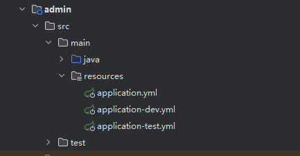

~~~
spring:
  cloud:
    nacos:
      config:
        contextPath: /nacos
        server-addr: http://[nacos地址]:[端口号]
        namespace: [命名空间]
        group: [分组]
        username: [登录用户名] # 没有设置登录名和密码可去除这两项
        password: [登录密码]

  config:
    import: nacos:[Data Id] # nacose配置文件的Data Id

cloud:
  compatibility-verifier:
    enabled: false
~~~

区分不同的运行环境所使用的配置文件，本地开发时可通过变更application.yml中的active来指定所使用的配置文件
~~~
spring:
  application:
    name: admin # 模块名称
  profiles:
    active: test # 配置文件标识
~~~

## nacos配置
* 先配置命名空间，命名空间名称可根据开发者需要来修改，但是需要和应用模块中的application配置文件中的配置相匹配

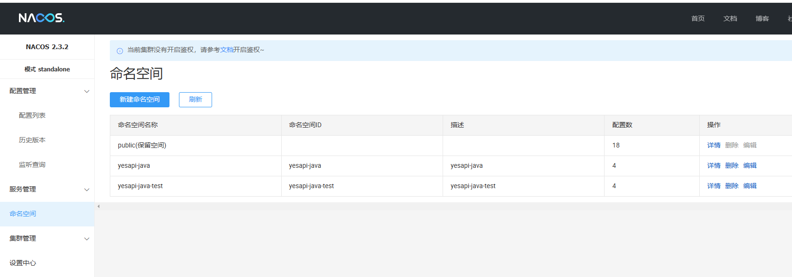

* 命名空间创建后导入配置文件，或手动创建配置文件将内容复制进去

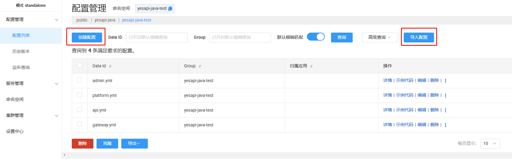

* 创建配置文件，选择YAML格式（注意语法和缩进），Data ID和Group都需要和应用模块中的application配置文件中的配置相匹配，手动将官方配置文件内容粘贴进去

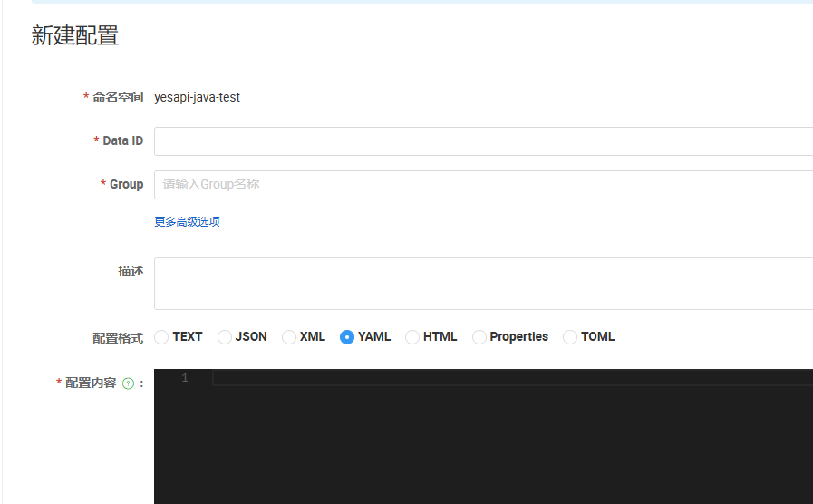

### 修改配置文件内容，主要包括（数据库连接和redis连接等），其他可根据开发需要修改
#### admin管理后台配置文件

~~~
environment: test

server:
  port: 7113  # 对外暴露的端口和制作docker镜像编写的DockerFile中的端口一致  
  address: 0.0.0.0
  servlet:
    context-path: /admin
    session:
      cookie:
        max-age: 604800

spring:
  datasource:
    driver-class-name: com.mysql.cj.jdbc.Driver
    url: [数据库连接地址]
    username: [数据库用户名]
    password: [数据库密码]
  session:
    timeout: 86400
  servlet: 
    multipart:
      max-file-size: 50MB
      max-request-size: 50MB
  jackson:
    date-format: yyyy-MM-dd HH:mm:ss
    time-zone: GMT+8
  data:
    redis:
      host: [redis连接地址]
      port: [端口]
      password: [密码]
      database: 0
      timeout: 10s
      lettuce:
        pool:
          # 连接池最大连接数
          max-active: 200
          # 连接池最大阻塞等待时间（使用负值表示没有限制）
          max-wait: -1ms
          # 连接池中的最大空闲连接
          max-idle: 10
          # 连接池中的最小空闲连接
          min-idle: 0
  resources:
    static-locations: classpath:/META-INF/resources/,classpath:/resources/,classpath:/static/,classpath:/public/,file:./downloads/
mybatis-plus:
  configuration:
    map-underscore-to-camel-case: true
    log-impl: org.apache.ibatis.logging.stdout.StdOutImpl
  global-config:
    db-config:
      table-prefix: yj_
      logic-delete-field: isDelete 
      logic-delete-value: 1 
      logic-not-delete-value: 0 

springdoc:
  swagger-ui:
    path: /swagger-ui.html
    tags-sorter: alpha
    operations-sorter: alpha
    disable-swagger-default-url: true
  api-docs:
    enabled: true
    path: /v3/api-docs
  group-configs:
    - group: 'default'
      paths-to-match: '/**'
      packages-to-scan: cn.yesapi.java.admin

knife4j:
  enable: true
  setting:
    language: zh_cn

rsa:
    public_key: 'MIGfMA0GCSqGSIb3DQEBAQUAA4GNADCBiQKBgQC6PkUUATKRIwdWLgM/rwJVQwfb
hWGLaix4vFgNe4OQSY4gX5DRj0+VnQgxM+DqhlBG9wrp3LkS2BDBrA64hOc1vl7j
gIhS6mRZa5jvMmb6reQfZN1qBwnmFg66XPD+pawkHynBdM0NevZkx8UlzxTqnVrm
RWZTF2avNlCcXTnWfQIDAQAB'

    private_key: 'MIICdwIBADANBgkqhkiG9w0BAQEFAASCAmEwggJdAgEAAoGBALo+RRQBMpEjB1Yu
Az+vAlVDB9uFYYtqLHi8WA17g5BJjiBfkNGPT5WdCDEz4OqGUEb3CuncuRLYEMGs
DriE5zW+XuOAiFLqZFlrmO8yZvqt5B9k3WoHCeYWDrpc8P6lrCQfKcF0zQ169mTH
xSXPFOqdWuZFZlMXZq82UJxdOdZ9AgMBAAECgYB91/OfN8vuS+f6MG8bieqeqANY
LoEhzeUs077/pTTZuwnhEBHvt9FDu+68KFzSu1zlBqqGKRGZDQwNgXAU+CCthEsz
+jVcsyLO61RxZI7WAMGztQp/fpVvqCxbR9i4MFdLtaX8v1vWCu6NxNTCIoFpP2v5
wQKXDbm4g5fTLWrUdQJBAPHZvpG5FzJyIfiY7px4Jra1jNilO32wVbSWs68354dk
RPzq3lZssx+bD2ze7R8+iYSI7DjjQ82OslO2eSASJJsCQQDFI65K9OiYsO5zpTgV
UOBT40K8mvD36XCrHmOZ6VmSDdSAue183oVc8W7aU6riGZ0dwv3LiBJMbF+GSIpI
p0bHAkBkgFnC8KmFGwym49Z0SzG7R2KKPM+mAXr8Gov8yjx6dN5+Q5O1UmJ1Rdh5
I4JiM3iuDMAtO7PXXe8Y/oEDJMb1AkEAltt6GeQWRhpHLvoE09MDB07GmBudQKlD
zb7Ai1wVbf3lWuhswvxpY7lhkfMqtkDRiZ/YpTKohhD8fH7wSy6uqwJBAIthRG9K
9PGbVfU2f+zUHvr8cNJSRuCBudFxKR0zRds7TcugdDJnqjJu58nIZ38tWTS6YvMq
uCIJyThIHlCkSMk='

admin:
  white_list: 
    - '/admin/common/*'
    - '/admin/admin/login'
    - '/admin/swagger-ui.html'
    - '/admin/swagger-ui/*'
    - '/admin/v3/*'
    - '/admin/config/site_config'

  product_expire_time: '1个月=2592000,2个月=5184000,3个月=7776000,6个月=15552000,1年=31536000,2年=63072000' # 套餐有效时间列表[时间描述]:[有效时间秒数]

jwt: 
  exp: 2592000

api_url: 
  get_all_router: 'http://[域名]:[api模块端口号]/api/router/getall' # api路由映射接口

# 阿里云OSS配置信息
aliyunoss:
  endpoint: ''
  bucketName: 
  accessKeyId: 
  accessKeySecret: 
  folder: 'yesapi_java/admin/'
  host: ''
  isValidateType: true
  allowType:
    - image/jpeg
    - image/png
    - application/vnd.ms-excel
    - image/vnd.microsoft.icon
  allowSize: 10

sava:
  directory: downloads/

download:
  url.prefix: http://[域名]/admin/common/downloads/
~~~

#### platform开发平台配置文件

~~~
environment: test

server:
  port: 7114
  address: 0.0.0.0
  servlet:
    context-path: /platform
    session:
      cookie:
        # 一周
        max-age: 604800

spring:
  datasource:
    driver-class-name: com.mysql.cj.jdbc.Driver
    url: [数据库连接地址]
    username: [数据库用户名]
    password: [数据库密码]
  session:
      timeout: 86400
  servlet: 
    multipart:
      enabled: true
      max-file-size: 50MB
      max-request-size: 50MB
  data:
    redis:
      host: [redis连接地址]
      port: [端口]
      password: [密码]
      database: 0
      timeout: 10s
      lettuce:
        pool:
          # 连接池最大连接数
          max-active: 200
          # 连接池最大阻塞等待时间（使用负值表示没有限制）
          max-wait: -1ms
          # 连接池中的最大空闲连接
          max-idle: 10
          # 连接池中的最小空闲连接
          min-idle: 0
  resources:
    static-locations: classpath:/META-INF/resources/,classpath:/resources/,classpath:/static/,classpath:/public/,file:./downloads/

mybatis-plus:
  configuration:
    map-underscore-to-camel-case: true
    log-impl: org.apache.ibatis.logging.stdout.StdOutImpl
  global-config:
    db-config:
      table-prefix: yj_
      logic-delete-field: isDelete # 全局逻辑删除的实体字段名(since 3.3.0,配置后可以忽略不配置步骤2)
      logic-delete-value: 1 # 逻辑已删除值(默认为 1)
      logic-not-delete-value: 0 # 逻辑未删除值(默认为 0)

springdoc:
  swagger-ui:
    path: /swagger-ui.html
    tags-sorter: alpha
    operations-sorter: alpha
    disable-swagger-default-url: true
  api-docs:
    enabled: true
    path: /v3/api-docs
  group-configs:
    - group: 'default'
      paths-to-match: '/**'
      packages-to-scan: cn.yesapi.java.platform

knife4j:
  enable: true
  setting:
    language: zh_CN

rsa:
  public_key: 'MFwwDQYJKoZIhvcNAQEBBQADSwAwSAJBAMKxlcPb4qCP8DI+7AHxnwhS2jiRUOMS
5Fw0IHH8XGVuuvUf3qNBYtfLlEnV5aVECQvLET6tpY1aYiQRgKJandkCAwEAAQ=='

  private_key: 'MIIBUwIBADANBgkqhkiG9w0BAQEFAASCAT0wggE5AgEAAkEAwrGVw9vioI/wMj7s
AfGfCFLaOJFQ4xLkXDQgcfxcZW669R/eo0Fi18uUSdXlpUQJC8sRPq2ljVpiJBGA
olqd2QIDAQABAkBP3xa3wQ9aG3LIyjN8IKnDemn35vWuEmQIx4HAAW3OVkUZsT9W
V4mgKWdUBGeenqJZvt4ncUI5GX2F9/Ce1bLhAiEA8w8giv715yRR2bDRGz8DQXHA
/kF1KlcLWBeFJaOpQp0CIQDNDz3zV+dQvfpGyA7xtteYC/u3aBj8m8FoZR/Dud31
bQIgFzDRTRHIipZHjPq26N+ZQuxEmr3KHRETDwOne5Di/G0CIHa7m5haTqKuzcrM
LfMBdsYgMijZSpaBrTRAUWsoJP/lAiANVDIaEvkR50q487RolwawaW4mxn6Aj/pj
a0B5yvsoow=='

platform:
  white_list:
    - '/platform/swagger-ui/*'
    - '/platform/swagger-ui.html'
    - '/platform/v3/*'
    - '/platform/user/register'
    - '/platform/user/login'
    - '/platform/common/*'
    - '/platform/config/*'
    - '/platform/notify/*'

jwt:
  exp: 2592000

api_url: 
  get_all_router: 'http://[域名]:[api模块端口号]/api/router/getall' # api路由映射接口 

# 阿里云OSS配置信息
aliyunoss:
  endpoint: ''
  bucketName: 
  accessKeyId: 
  accessKeySecret: 
  folder: 'yesapi_java/admin/'
  host: ''
  isValidateType: true
  allowType:
    - image/jpeg
    - image/png
    - application/vnd.ms-excel
    - image/vnd.microsoft.icon
  allowSize: 10

sava:
  directory: downloads/

download:
  url.prefix: http://[域名]/platform/common/downloads/

payConfig:
  alipay: # 支付宝配置
    appId: [应用appId]
    notifyUrl: http://[域名]/platform/notify/alipay_page_pay_notify # 支付宝回调地址
    returnUrl: http://[域名]/platform/#/permission/buyResult # 支付成功跳转页面
    privateKey: '应用私钥'
    publicKey: '支付宝公钥'
  wechatpay: # 微信支付配置
    merchantId: '商户ID'
    merchantSerialNumber: '商户序列号'
    apiV3Key: 'apiv3key'
    appId: 'AppID'
    notifyUrl: http://xxx.com/platform/notify/wechatpay_page_pay_notify
    privateKey: '支付私钥'
~~~


 + **如何查看获取支付宝的应用私钥和支付宝公钥？**  

在[支付宝开放平台](https://open.alipay.com/dev/workspace) 需要创建一个【网页&移动应用】，类似： 
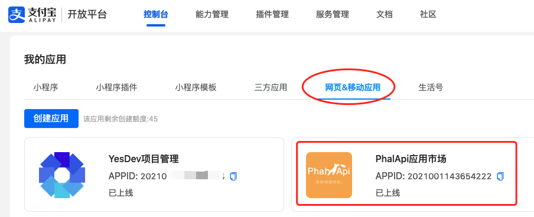  

然后 【+添加能力】，开通签约【电脑网站支付】：  
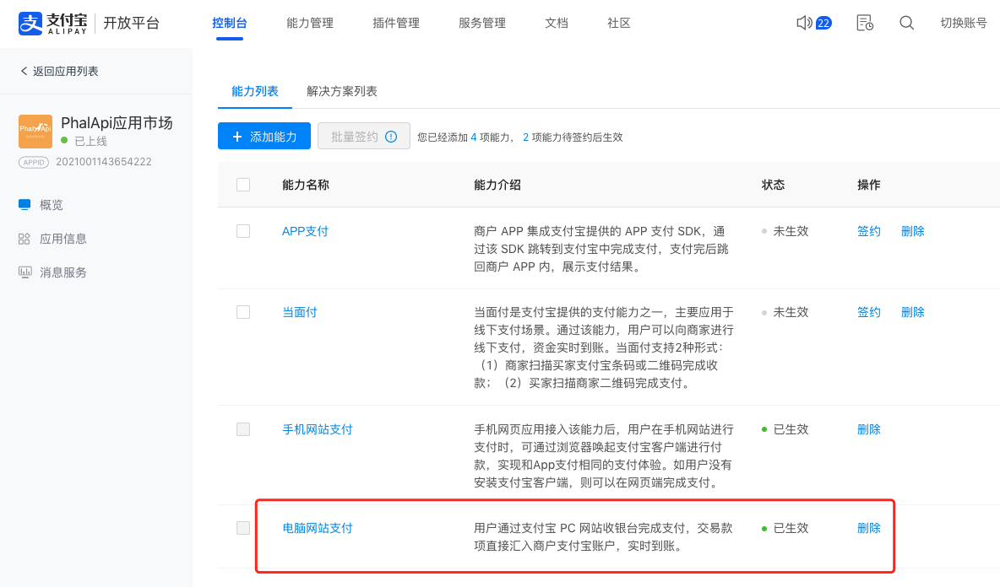  

最后，在应用信息，可以设置和查看支付宝的应用私钥和支付宝公钥。  

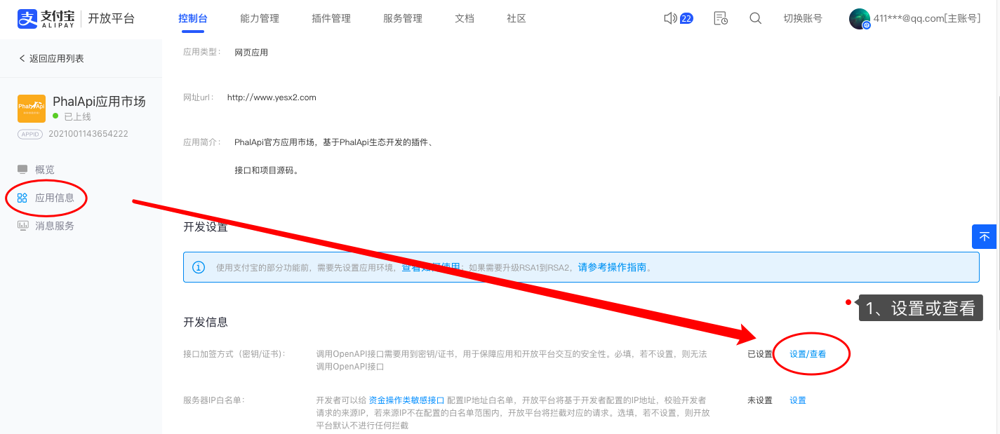

发送输入验证码：  
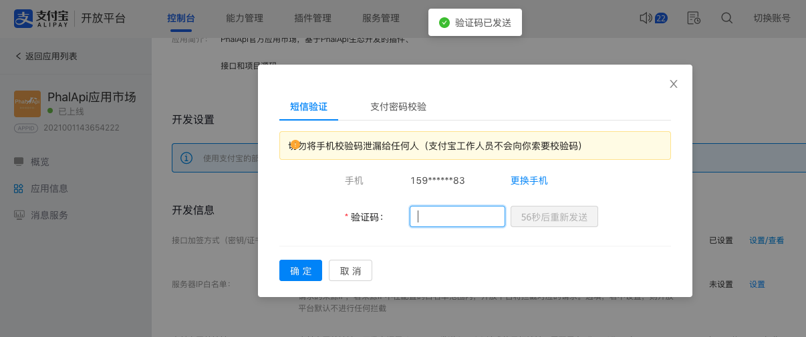  

重新上传设置应用私钥，和复制支付宝公钥。  
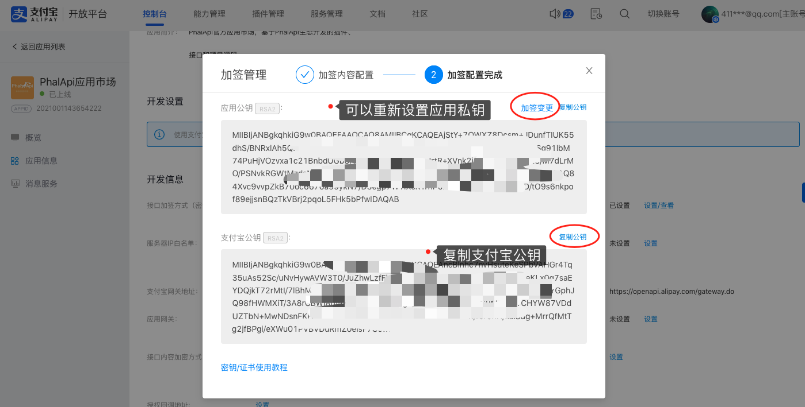  

 + **如何获取微信支付配置？**  

登录[微信支付平台](https://pay.weixin.qq.com)后，在【账户中心】-【API安全】，  
通过【商户API证书】获取 ```merchantSerialNumber``` 商户序列号 ；通过【APIv3密钥】可以获取配置项 ```apiV3Key```；通过 【平台证书】获取 ```privateKey``` 支付私钥。  

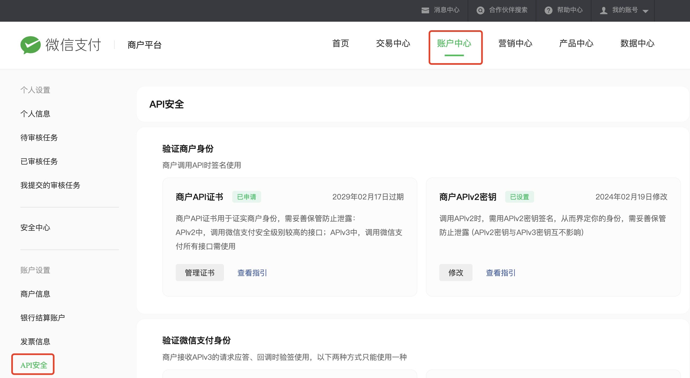  

然后，在【产品中心】-【AppID账号管理】可以获取配置项 ```appId``` 和 ```merchantId``` 商户ID。最后 ```notifyUrl``` 是当前接口平台的微信支付回调地址，只需要替换自己的域名。  

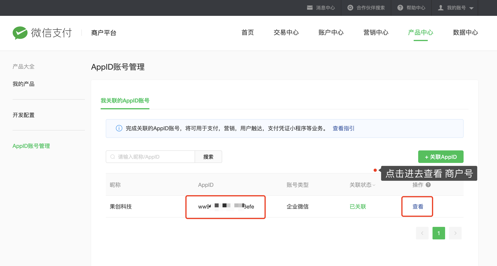  

#### gateway网关配置文件

~~~
server:
  port: 7112

spring:
  cloud:
    gateway:
      routes:
        - id: api
          uri: http://[域名或ip]:7115 #api模块端口号
          predicates:
            - Path=/api/**
  profiles:
    active: test
  datasource:
    driver-class-name: com.mysql.cj.jdbc.Driver
    url: [数据库连接地址]
    username: [数据库用户名]
    password: [数据库密码]
  session:
    timeout: 86400
  data:
    redis:
      host: [redis连接地址]
      port: [端口]
      password: [密码]
      database: 0
      timeout: 10s
      lettuce:
        pool:
          # 连接池最大连接数
          max-active: 200
          # 连接池最大阻塞等待时间（使用负值表示没有限制）
          max-wait: -1ms
          # 连接池中的最大空闲连接
          max-idle: 10
          # 连接池中的最小空闲连接
          min-idle: 0

mybatis-plus:
  configuration:
    map-underscore-to-camel-case: true
    log-impl: org.apache.ibatis.logging.stdout.StdOutImpl
  global-config:
    db-config:
      table-prefix: yj_
      logic-delete-field: isDelete 
      logic-delete-value: 1 
      logic-not-delete-value: 0    

rsa:
  private_key: 'MIICdwIBADANBgkqhkiG9w0BAQEFAASCAmEwggJdAgEAAoGBALo+RRQBMpEjB1Yu
Az+vAlVDB9uFYYtqLHi8WA17g5BJjiBfkNGPT5WdCDEz4OqGUEb3CuncuRLYEMGs
DriE5zW+XuOAiFLqZFlrmO8yZvqt5B9k3WoHCeYWDrpc8P6lrCQfKcF0zQ169mTH
xSXPFOqdWuZFZlMXZq82UJxdOdZ9AgMBAAECgYB91/OfN8vuS+f6MG8bieqeqANY
LoEhzeUs077/pTTZuwnhEBHvt9FDu+68KFzSu1zlBqqGKRGZDQwNgXAU+CCthEsz
+jVcsyLO61RxZI7WAMGztQp/fpVvqCxbR9i4MFdLtaX8v1vWCu6NxNTCIoFpP2v5
wQKXDbm4g5fTLWrUdQJBAPHZvpG5FzJyIfiY7px4Jra1jNilO32wVbSWs68354dk
RPzq3lZssx+bD2ze7R8+iYSI7DjjQ82OslO2eSASJJsCQQDFI65K9OiYsO5zpTgV
UOBT40K8mvD36XCrHmOZ6VmSDdSAue183oVc8W7aU6riGZ0dwv3LiBJMbF+GSIpI
p0bHAkBkgFnC8KmFGwym49Z0SzG7R2KKPM+mAXr8Gov8yjx6dN5+Q5O1UmJ1Rdh5
I4JiM3iuDMAtO7PXXe8Y/oEDJMb1AkEAltt6GeQWRhpHLvoE09MDB07GmBudQKlD
zb7Ai1wVbf3lWuhswvxpY7lhkfMqtkDRiZ/YpTKohhD8fH7wSy6uqwJBAIthRG9K
9PGbVfU2f+zUHvr8cNJSRuCBudFxKR0zRds7TcugdDJnqjJu58nIZ38tWTS6YvMq
uCIJyThIHlCkSMk='

api:
  whitelist:
    - '/api/official/auth/apply_token'
    - '/api/swagger-ui.html'
    - '/api/swagger-ui/*'
    - '/api/swagger-config/*'
    - '/api/v3/*'
~~~

#### API接口配置文件

~~~
server:
  port: 7115
  address: 0.0.0.0
  servlet:
    context-path: /api
    session:
      cookie:
        max-age: 604800

spring:
  datasource:
    driver-class-name: com.mysql.cj.jdbc.Driver
    url: [数据库连接地址]
    username: [数据库用户名]
    password: [数据库密码]
  session:
    timeout: 86400
  data:
    redis:
      host: [redis连接地址]
      port: [端口]
      password: [密码]
      database: 0
      timeout: 100s
      lettuce:
        pool:
          # 连接池最大连接数
          max-active: 200
          # 连接池最大阻塞等待时间（使用负值表示没有限制）
          max-wait: -1ms
          # 连接池中的最大空闲连接
          max-idle: 10
          # 连接池中的最小空闲连接
          min-idle: 0

mybatis-plus:
  configuration:
    map-underscore-to-camel-case: true
    log-impl: org.apache.ibatis.logging.stdout.StdOutImpl
  global-config:
    db-config:
      table-prefix: yj_
      logic-delete-field: isDelete # 全局逻辑删除的实体字段名(since 3.3.0,配置后可以忽略不配置步骤2)
      logic-delete-value: 1 # 逻辑已删除值(默认为 1)
      logic-not-delete-value: 0 # 逻辑未删除值(默认为 0)

springdoc:
  swagger-ui:
    path: /swagger-ui.html
    tags-sorter: alpha
    operations-sorter: alpha
    disable-swagger-default-url: true
  api-docs:
    # enabled: true
    path: /v3/api-docs
  group-configs:
    - group: 'default'
      paths-to-match: '/**'
      packages-to-scan: cn.yesapi.java.api
  info: 
    url: http://[域名]/api
    title: 接口大师
    description: 测试服
    version: 1.0.1
      
rsa:
  public_key: 'MIGfMA0GCSqGSIb3DQEBAQUAA4GNADCBiQKBgQC6PkUUATKRIwdWLgM/rwJVQwfb
hWGLaix4vFgNe4OQSY4gX5DRj0+VnQgxM+DqhlBG9wrp3LkS2BDBrA64hOc1vl7j
gIhS6mRZa5jvMmb6reQfZN1qBwnmFg66XPD+pawkHynBdM0NevZkx8UlzxTqnVrm
RWZTF2avNlCcXTnWfQIDAQAB'

  private_key: 'MIICdwIBADANBgkqhkiG9w0BAQEFAASCAmEwggJdAgEAAoGBALo+RRQBMpEjB1Yu
Az+vAlVDB9uFYYtqLHi8WA17g5BJjiBfkNGPT5WdCDEz4OqGUEb3CuncuRLYEMGs
DriE5zW+XuOAiFLqZFlrmO8yZvqt5B9k3WoHCeYWDrpc8P6lrCQfKcF0zQ169mTH
xSXPFOqdWuZFZlMXZq82UJxdOdZ9AgMBAAECgYB91/OfN8vuS+f6MG8bieqeqANY
LoEhzeUs077/pTTZuwnhEBHvt9FDu+68KFzSu1zlBqqGKRGZDQwNgXAU+CCthEsz
+jVcsyLO61RxZI7WAMGztQp/fpVvqCxbR9i4MFdLtaX8v1vWCu6NxNTCIoFpP2v5
wQKXDbm4g5fTLWrUdQJBAPHZvpG5FzJyIfiY7px4Jra1jNilO32wVbSWs68354dk
RPzq3lZssx+bD2ze7R8+iYSI7DjjQ82OslO2eSASJJsCQQDFI65K9OiYsO5zpTgV
UOBT40K8mvD36XCrHmOZ6VmSDdSAue183oVc8W7aU6riGZ0dwv3LiBJMbF+GSIpI
p0bHAkBkgFnC8KmFGwym49Z0SzG7R2KKPM+mAXr8Gov8yjx6dN5+Q5O1UmJ1Rdh5
I4JiM3iuDMAtO7PXXe8Y/oEDJMb1AkEAltt6GeQWRhpHLvoE09MDB07GmBudQKlD
zb7Ai1wVbf3lWuhswvxpY7lhkfMqtkDRiZ/YpTKohhD8fH7wSy6uqwJBAIthRG9K
9PGbVfU2f+zUHvr8cNJSRuCBudFxKR0zRds7TcugdDJnqjJu58nIZ38tWTS6YvMq
uCIJyThIHlCkSMk='

jwt:
  exp: 2592000

api:
  whitelist:
    - '/api/official/auth/apply_token'
    - '/api/swagger-ui.html'
    - '/api/swagger-ui/*'
    - '/api/swagger-config/*'
    - '/api/v3/*'
~~~
