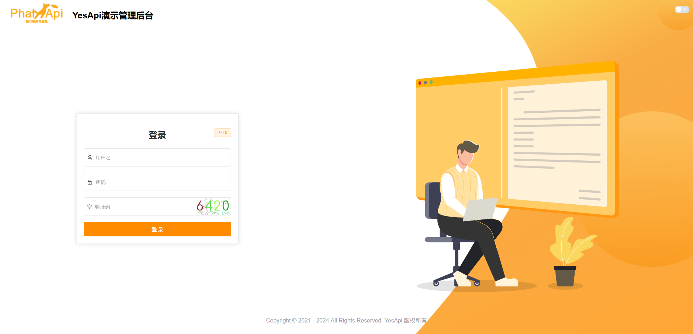
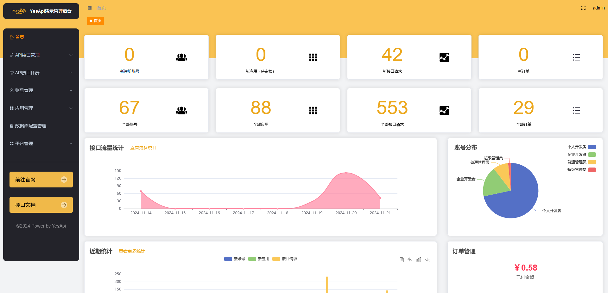

# 如何开发Admin管理后台


<div>
  
  
  
  
  
</div>

<hr>

<div>
  <a target="_blank" href="http://java.test.yesapi.cn/admin">🔍 在线预览</a>
</div>

## 项目简介

[Admin管理后台](http://java.test.yesapi.cn/admin) 是基于 Vue3 + Vite5 + TypeScript5 + Element-Plus + Pinia 等主流技术栈构建的接口大师管理后台。

## 目录结构

```
├── public  打包所需静态资源
└── src
    ├── api  AJAX请求
    └── assets  项目静态资源
        ├── icons  自定义图标资源
        └── images  图片资源
    ├── components  业务组件
    ├── directive  自定义指令
    ├── enums  枚举文件
    ├── lang  多语言文件
    ├── layout  布局
    ├── plugins  第三方插件
    ├── router  路由配置
    ├── store  Pinia配置
    ├── styles  样式文件
    ├── types  全局类型说明文件
    ├── utils  封装工具函数
    ├── views  页面文件
    └── App.vue  页面入口文件
```

## 项目特色

- **简洁易用**：基于 Element-Plus + Vue3 构建，无过渡封装 ，易上手。

- **数据交互**：同时支持本地 `Mock` 和线上接口。

- **权限管理**：用户、角色、菜单、字典、部门等完善的权限系统功能。

- **基础设施**：动态路由、按钮权限、国际化、代码规范、Git 提交规范、常用组件封装。

- **持续更新**：项目持续更新，实时更新工具和依赖。
  
- **响应式布局**：基于响应式布局，自适应 PC 端、平板、手机等。

## 项目预览





## 环境准备

| 环境                 | 名称版本                                                     | 下载地址                                                     |
| -------------------- | :----------------------------------------------------------- | ------------------------------------------------------------ |
| **开发工具**         | VSCode (推荐)     | [下载](https://code.visualstudio.com/Download)           |
| **运行环境**         | Node ≥18 (其中 20.6.0 版本不可用)    | [下载](http://nodejs.cn/download)                        |

## 项目启动

```bash
# 安装 pnpm
npm install pnpm -g

# 设置镜像源(可忽略)
pnpm config set registry https://registry.npmmirror.com

# 安装依赖
pnpm install

# 启动运行
pnpm run dev
```

## 接口使用

修改根目录下env.development（开发环境）、env.production（生产环境）文件中的接口地址以及基础路径（可新增环境，只需要加入相关配置），重新打包

```txt
VITE_APP_API_URL = 你的域名
VITE_APP_BASE_API = 你的接口基础路径（比如/api）
```

## 项目部署

```bash
# 项目打包
pnpm run build

# 打包后生成的dist目录
├── css  # 样式
├── ico  # 图标文件
├── img # 图片
├── js # js代码
├── static # 静态资源
├── favicon.ico  # 图标
└── index.html # 首页文件

# 上传文件至远程服务器
最后把dist目录里面全部的文件复制替换到docker-static/admin/，更新到生产环境即可。
```

## 本地Mock

项目同时支持在线和本地 Mock 接口，默认使用线上接口，如需替换为 Mock 接口，修改文件 `.env.development` 的 `VITE_MOCK_DEV_SERVER` 为  `true` **即可**。

## 注意事项

- **自动导入插件自动生成默认关闭**

  模板项目的组件类型声明已自动生成。如果添加和使用新的组件，请按照图示方法开启自动生成。在自动生成完成后，记得将其设置为 `false`，避免重复执行引发冲突。

- **项目启动浏览器访问空白**

  请升级浏览器尝试，低版本浏览器内核可能不支持某些新的 JavaScript 语法，比如可选链操作符 `?.`。

- **项目同步仓库更新升级**

  项目同步仓库更新升级之后，建议 `pnpm install` 安装更新依赖之后启动 。

- **项目组件、函数和引用爆红**

  重启 VSCode 尝试

## 项目文档

- [YesApi Java版文档](http://java.test.yesapi.cn/wiki)
