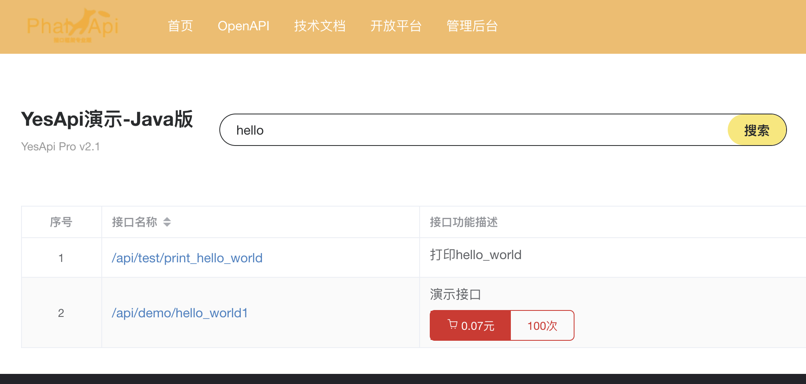
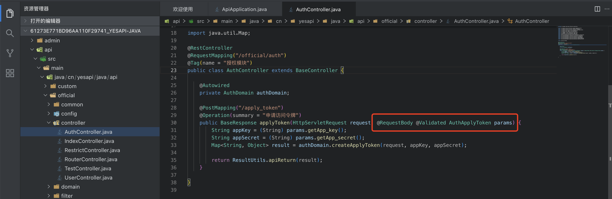
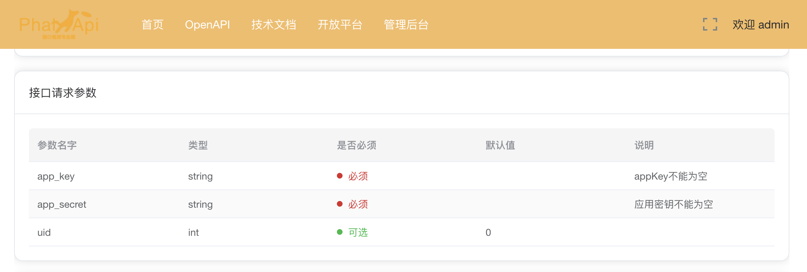

# 如何开发接口

使用YesApi Java版开发接口，需要熟悉springboot3+mybaits-plus+maven的开发模式

## 目录结构

YseApi Java版的目录结构如下，

```bash

├─admin  # 管理后台应用模块
│  ├─src
│  │  ├─main
│  │  │  ├─java
│  │  │  │  └─cn
│  │  │  │      └─yesapi
│  │  │  │          └─java
│  │  │  │              └─admin
│  │  │  │                  ├─common # 公共基础类
│  │  │  │                  ├─config # 系统配置
│  │  │  │                  ├─controller # 控制器
│  │  │  │                  ├─domain # 业务处理核心
│  │  │  │                  ├─model # 数据库模型
│  │  │  │                  │  ├─enumer # 枚举
│  │  │  │                  │  └─mapper 
│  │  │  │                  ├─service # 接口服务
│  │  │  │                  │  └─impl # 接口实现类
│  │  │  │                  ├─tool  # 工具类
│  │  │  │                  └─validator # 方法参数校验
│  │  │  └─resources # 应用资源目录，包含application.yml等配置文件
│  │  └─test # 代码测试模块
│  │      └─java
│  │          └─cn
│  │              └─yesapi
│  │                  └─java
│  │                      └─admin
│  └─target # 项目构建的资源和文件，包含打包后的jar包等
│      ├─classes
│      │  └─cn
│      │      └─yesapi
│      │          └─java
│      │              └─admin
│      │                  ├─common
│      │                  ├─config
│      │                  ├─controller
│      │                  ├─domain
│      │                  ├─model
│      │                  │  ├─enumer
│      │                  │  └─mapper
│      │                  ├─service
│      │                  │  └─impl
│      │                  ├─tool
│      │                  └─validator
│      ├─generated-sources
│      │  └─annotations
│      ├─generated-test-sources
│      │  └─test-annotations
│      ├─maven-archiver
│      ├─maven-status
│      │  └─maven-compiler-plugin
│      │      ├─compile
│      │      │  └─default-compile
│      │      └─testCompile
│      │          └─default-testCompile
│      └─test-classes
│          └─cn
│              └─yesapi
│                  └─java
│                      └─admin
├─api # Api应用模块，目录结构作用同上
│  ├─.mvn
│  │  └─wrapper
│  ├─src
│  │  ├─main
│  │  │  ├─java
│  │  │  │  └─cn
│  │  │  │      └─yesapi
│  │  │  │          └─java
│  │  │  │              └─api
│  │  │  │                  ├─custom
│  │  │  │                  │  └─controller
│  │  │  │                  ├─customer
│  │  │  │                  └─official
│  │  │  │                      ├─common
│  │  │  │                      ├─config
│  │  │  │                      ├─controller
│  │  │  │                      ├─domain
│  │  │  │                      ├─filter # 过滤器
│  │  │  │                      ├─model
│  │  │  │                      │  ├─enumer
│  │  │  │                      │  └─mapper
│  │  │  │                      ├─service
│  │  │  │                      │  └─impl
│  │  │  │                      ├─tool
│  │  │  │                      └─validator
│  │  │  └─resources
│  │  └─test
│  │      └─java
│  │          └─cn
│  │              └─yesapi
│  │                  └─java
│  │                      └─api
│  └─target
│      ├─classes
│      │  └─cn
│      │      └─yesapi
│      │          └─java
│      │              └─api
│      │                  ├─custom
│      │                  │  └─controller
│      │                  └─official
│      │                      ├─common
│      │                      ├─config
│      │                      ├─controller
│      │                      ├─domain
│      │                      ├─filter
│      │                      ├─model
│      │                      │  ├─enumer
│      │                      │  └─mapper
│      │                      ├─service
│      │                      │  └─impl
│      │                      ├─tool
│      │                      └─validator
│      ├─generated-sources
│      │  └─annotations
│      ├─generated-test-sources
│      │  └─test-annotations
│      ├─maven-archiver
│      ├─maven-status
│      │  └─maven-compiler-plugin
│      │      ├─compile
│      │      │  └─default-compile
│      │      └─testCompile
│      │          └─default-testCompile
│      └─test-classes
│          └─cn
│              └─yesapi
│                  └─java
│                      └─api
├─bin # 脚本目录
├─common # 系统公共基础类
│  ├─src
│  │  └─main
│  │      ├─java
│  │      │  └─cn
│  │      │      └─yesapi
│  │      │          └─java
│  │      │              └─common
│  │      │                  ├─enumer # 枚举
│  │      │                  ├─exception # 自定义异常
│  │      │                  ├─model # 数据库模型
│  │      │                  │  └─table # 数据库实体类
│  │      │                  └─tool # 工具目录
│  │      └─resources
│  └─target
│      ├─classes
│      │  └─cn
│      │      └─yesapi
│      │          └─java
│      │              └─common
│      │                  ├─enumer
│      │                  ├─exception
│      │                  ├─model
│      │                  │  └─table
│      │                  └─tool
│      ├─generated-sources
│      │  └─annotations
│      ├─maven-archiver
│      └─maven-status
│          └─maven-compiler-plugin
│              └─compile
│                  └─default-compile
├─data # 数据库和nacos配置文件目录
│  └─nacos
├─gateway # 网关应用模块，主要和API接口模块配合，进行接口请求校验处理等
│  ├─src
│  │  ├─main
│  │  │  ├─java
│  │  │  │  └─cn
│  │  │  │      └─yesapi
│  │  │  │          └─java
│  │  │  │              └─gateway
│  │  │  │                  ├─config
│  │  │  │                  ├─exception
│  │  │  │                  ├─model
│  │  │  │                  │  └─mapper
│  │  │  │                  └─utils
│  │  │  └─resources
│  │  └─test
│  │      └─java
│  │          └─cn
│  │              └─yesapi
│  │                  └─java
│  │                      └─gateway
│  └─target
│      ├─classes
│      │  └─cn
│      │      └─yesapi
│      │          └─java
│      │              └─gateway
│      │                  ├─config
│      │                  ├─exception
│      │                  ├─model
│      │                  │  └─mapper
│      │                  └─utils
│      ├─generated-sources
│      │  └─annotations
│      ├─generated-test-sources
│      │  └─test-annotations
│      └─test-classes
│          └─cn
│              └─yesapi
│                  └─java
│                      └─gateway
├─platform # 开发平台应用模块，目录结构作用同上
│  ├─src
│  │  ├─main
│  │  │  ├─java
│  │  │  │  └─cn
│  │  │  │      └─yesapi
│  │  │  │          └─java
│  │  │  │              └─platform
│  │  │  │                  ├─common
│  │  │  │                  ├─config
│  │  │  │                  ├─controller
│  │  │  │                  ├─domain
│  │  │  │                  ├─model
│  │  │  │                  │  ├─enumer
│  │  │  │                  │  └─mapper
│  │  │  │                  ├─service
│  │  │  │                  │  └─impl
│  │  │  │                  ├─tool
│  │  │  │                  └─validator
│  │  │  └─resources
│  │  └─test
│  │      └─java
│  │          └─cn
│  │              └─yesapi
│  │                  └─java
│  │                      └─platform
│  └─target
│      ├─classes
│      │  └─cn
│      │      └─yesapi
│      │          └─java
│      │              └─platform
│      │                  ├─common
│      │                  ├─config
│      │                  ├─controller
│      │                  ├─domain
│      │                  ├─model
│      │                  │  ├─enumer
│      │                  │  └─mapper
│      │                  ├─service
│      │                  │  └─impl
│      │                  ├─tool
│      │                  └─validator
│      ├─generated-sources
│      │  └─annotations
│      ├─generated-test-sources
│      │  └─test-annotations
│      ├─maven-archiver
│      ├─maven-status
│      │  └─maven-compiler-plugin
│      │      ├─compile
│      │      │  └─default-compile
│      │      └─testCompile
│      │          └─default-testCompile
│      └─test-classes
│          └─cn
│              └─yesapi
│                  └─java
│                      └─platform
└─website # 官网应用模块，目录结构作用同上
    ├─src
    │  ├─main
    │  │  ├─java
    │  │  │  └─cn
    │  │  │      └─yesapi
    │  │  │          └─java
    │  │  │              └─website
    │  │  │                  ├─common
    │  │  │                  ├─controller
    │  │  │                  ├─domain
    │  │  │                  ├─exception
    │  │  │                  ├─model
    │  │  │                  │  └─mapper
    │  │  │                  ├─service
    │  │  │                  │  └─Impl
    │  │  │                  └─tool
    │  │  └─resources
    │  └─test
    │      └─java
    │          └─cn
    │              └─yesapi
    │                  └─java
    │                      └─website
    └─target
        ├─classes
        │  └─cn
        │      └─yesapi
        │          └─java
        │              └─website
        │                  ├─common
        │                  ├─controller
        │                  ├─domain
        │                  ├─exception
        │                  ├─model
        │                  │  └─mapper
        │                  ├─service
        │                  │  └─Impl
        │                  └─tool
        ├─generated-sources
        │  └─annotations
        ├─generated-test-sources
        │  └─test-annotations
        └─test-classes
            └─cn
                └─yesapi
                    └─java
                        └─website
```

## 编写Api接口层

如果需要编写开放接口，可以在cn/yesapi/java/api/controller目录下新增一个java文件，类名和文件名一样（需要区分大小写）。  

例如开放接口的Hello World1示例，接口文件是：cn.yesapi.java.api.custom.controller.Demo，类名是：Demo，对接的接口服务名称是：api/demo/hello_world1。  

```java
package cn.yesapi.java.api.custom.controller;

import cn.yesapi.java.common.tool.BaseResponse;
import cn.yesapi.java.common.tool.ResultUtils;
import io.swagger.v3.oas.annotations.Operation;
import io.swagger.v3.oas.annotations.tags.Tag;
import org.springframework.web.bind.annotation.GetMapping;
import org.springframework.web.bind.annotation.RequestMapping;
import org.springframework.web.bind.annotation.RestController;

@RestController
@RequestMapping("/demo")
@Tag(name = "demo")
public class Demo {
    @GetMapping("/hello_world1")
    @Operation(summary = "演示接口")
    public BaseResponse helloWorld1(){
        return ResultUtils.apiReturn("Hello World!");
    }
}
```

保存后，访问接口文档列表，可以看到以下新接口：  


如果需要编写后台接口，则需要放置在cn/yesapi/java/admin/目录下，其他开发要求类似。

## 如何设置接口请求参数规则？

统一用 Javax.Validation注解 对接口参数进行注解，例如：接口参数的默认值、长度限制、最大值、最小值、参数说明和其它配置。  

| 注解         | 说明                                                                 |
|--------------|--------------------------------------------------------------------|
| `@NotNull`   | 元素必须非空（非 `null` 且非空字符串）                                |
| `@NotEmpty`  | 元素必须非空且长度 > 0                                               |
| `@NotBlank`  | 元素字符串必须非空，并且至少包含一个非空白字符                         |
| `@Null`      | 元素必须为 `null`                                                    |
| `@AssertTrue`| 元素布尔值必须为 `true`                                               |
| `@AssertFalse`| 元素布尔值必须为 `false`                                             |
| `@Email`     | 元素必须是有效的电子邮件地址                                          |
| `@Size`      | 字符串或集合的数量是否在指定的范围之内                                 |
| `@Length`    | 字符串元素的长度是否在指定的范围内                                     |
| `@Pattern`   | 元素是否符合指定的正则表达式匹配                                       |

例如，```/api/official/auth/apply_token```申请令牌接口中的参数注解如下：

接口文件：api/src/main/java/cn/yesapi/java/api/official/controller/AuthController.java  

```java
@RestController
@RequestMapping("/official/auth")
@Tag(name = "授权模块")
public class AuthController extends BaseController {

    @Autowired
    private AuthDomain authDomain;

    @PostMapping("/apply_token")
    @Operation(summary = "申请访问令牌")
    public BaseResponse applyToken(HttpServletRequest request, @RequestBody @Validated AuthApplyToken params) {
        String appKey = (String) params.getApp_key();
        String appSecret = (String) params.getApp_secret();
        Map<String, Object> result = authDomain.createApplyToken(request, appKey, appSecret);

        return ResultUtils.apiReturn(result);
    }
}
```

  

其中，接口参数的类及注解写法请参考文件，api/src/main/java/cn/yesapi/java/api/official/validator/AuthApplyToken.java。
```java
package cn.yesapi.java.api.official.validator;

import jakarta.validation.constraints.NotBlank;
import lombok.Data;

@Data
public class AuthApplyToken {

    @NotBlank(message = "app_key不能为空")
    private String app_key;
    @NotBlank(message = "应用密钥不能为空")
    private String app_secret;
    private int uid;
}
```

最后，接口详情页，文档展示效果如下：  

  

## 如何取消接口令牌验证？

默认情况下，前台接口需要进行```access-token```令牌验证，以保护接口不被非法请求。如果不需要对指定的接口进行验证，可以在对应的应用模块的nacos配置文件中配置白名单，例如上面的helloWorld1接口不需要接口验证，可以在最后追加配置：  

```yml
api:
  whitelist:
    - '/api/index/index'
    - '/api/demo/hello_world1'
```

接口白名单配置，过滤器将忽略该接口，不进行任何校验和判断，此时不会相应调整应用的接口权限。如果需要让接口权限在界面上显示保持一致，可以配置接口权限规则。  

> 温馨提示：配置接口白名单，开放平台和管理后台的接口权限显示不会影响。  

## 如何获取当前上下文信息？
如何获取token信息，登录会员ID？  

在BaseController接口基类中，已经封装了针对于token、登录会员ID等接口，方便项目快速开发。  

以下是使用代码和相关说明。  

```java
@RestController
@RequestMapping("/demo")
@Tag(name = "demo")
public class Demo extends BaseController {
    @GetMapping("/hello_world1")
    @Operation(summary = "演示接口")
    public BaseResponse helloWorld1(){
        // 获取用户id
        Integer uid = this.getUid();
        // 获取token信息
        Map<String,Object> token = this.getTokenInfo();
    }
}
```

## 编写Domain领域层

Domain领域层主要用于封装复杂的业务逻辑、规则和算法。此部分Java代码放置在每个应用模块对应的domain目录下。此部分根据不同项目的业务需求，具体开发即可。

## 编写Model数据层

Model数据层主要用于操作MySQL数据库，基于mybaits-plus编写，创建数据库表对应的Mapper，接口service和实现类impl:
~~~
├─model
│  ├─enumer
│  └─mapper
├─service
│  └─impl
~~~


