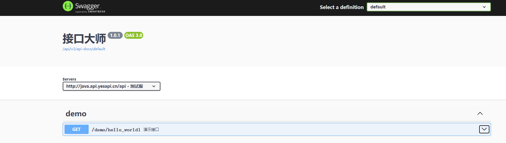
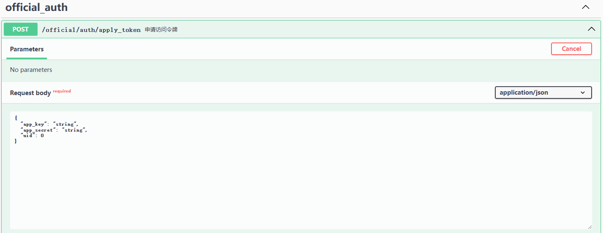
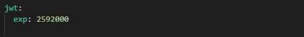

# 如何调用接口

以下将通过简明的方式，介绍客户端如何调用接口。 

## API入口

 + Platform开放平台接口API入口：http://java.platform.yesapi.cn/platform/  
 + Admin管理后台接口API入口：http://java.admin.yesapi.cn/admin/
 + Api入口：http://java.api.yesapi.cn/api/

首先，不同系列的接口，必须要找到对应的API入口。因为不同的入口处理的方式、权限判断和场景都不相同，并且方便分别进行个性化控制而不相互影响。  

## 请求方式

通过HTTP/HTTPS协议，便可以请求接口。详细接口请求方式和参数可通过swagger在线文档查看各端的api接口
例如：http://java.api.yesapi.cn/api/swagger-ui/index.html



请求格式为：域名+应用模块名称+接口路径

例如对于默认的接口服务：http://java.api.yesapi.cn/api/demo/hello_world1，直接用浏览器打开访问，可以得到结果：  
```
{
    "code": 200,
    "message": "SUCCESS",
    "data": "Hello World!"
}
``` 

## 请求参数
POST请求方式一律使用json格式传递参数

公共的接口参数目前有：  

 + access-token：token令牌，用于接口验证，后面会继续讲解。

每个接口的参数，可以通过接口文档查看，例如：


 

## 返回结构

接口返回的是JSON格式。例如：  
```
{"code":200,"message":"SUCCESS","data":"Hello World!"}
```
格式后是：  
```
{
    "code": 200,
    "message": "SUCCESS",
    "data": "Hello World!"
}
```

全部接口，返回的接口结果结构分为三部分：  

 + code：状态码，整型，200表示成功，4xx表示客户端非法请求，5xx表示服务器错误
 + data：成功时返回的业务数据，通常为对象类型，具体由接口服务而定
 + msg：失败时的错误提示信息，字符类型

## 验证方式

YesApi Java版使用的是access-token令牌验证的方式，在开始使用接口时，需要先申请令牌：  

 + 通过应用来申请令牌：根据开发者应用的app_key和app_secret申请access_token令牌
  

## 获取令牌

### 方式一：通过应用来申请令牌

这种方式，要求：  

 + 应用存在：首先需要创建应用，并且审核通过
 + 密钥正确：应用app_key和app_secret正确
 + 正常状态：应用处于正常状态（若为禁用则不可用）
 + 接口权限：应用在调用指定接口时需要拥有相应接口的权限

需要使用的接口是：```/api/official/auth/apply_token```。  

## 刷新令牌

令牌过期时间默认为30天，可以通过修改对应的应用模块的nacos配置文件的jwt里的exp来自行修改，单位秒数：



## 开放平台与管理后台的身份校验

对于内部，可以通过登录开发者账号，或者通过登录管理员账号来获得令牌。此时使用的接口是```/platform/user/login```。


