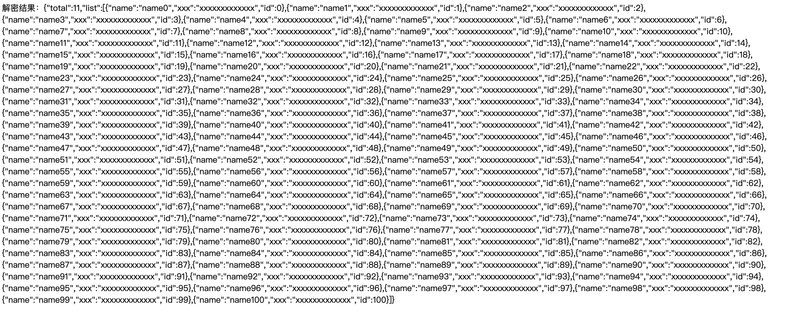

# 接口返回数据加密

对于数据安全性高的场景，客户需要对接口返回数据进行加密，客户端再进行解密。为了提升接口返回数据的安全性，支持接口返回数据内容的脱敏加密返回，即针对data接口返回数据加密，每个应用单独配置密钥，支持多种客户端编程语言进行解密。 **请注意：仅对JSON返回格式的data字段进行加密，下载文件或者字符串返回都不进行加密。** 

## ASE加密算法

采用 AES加密算法。**请注意：为方便维护，iv和ASE密钥保持一致**。  

AES（高级加密标准，Advanced Encryption Standard）是一种广泛使用的对称加密算法，用于保护电子数据的机密性。以下是其核心要点：  

 - **对称加密**：加密与解密使用同一密钥，需确保密钥安全传输。
 - **分组加密**：将数据划分为**128位（16字节）的固定块**进行处理。
 - **密钥长度**：支持**128位、192位、256位**三种密钥，安全性递增（如AES-128、AES-256）。
 - **抗攻击性**：目前无已知高效攻击方式，暴力破解AES-128需数万亿年（假设每秒尝试1亿亿次）。  

## 如何开启和关闭数据加密？

进入 开发平台的应用管理，点击【加密配置】按钮，在【接口数据加密开关】切换到【开启】。  
  

首次配置加密时，请先【重新生成】ASE密钥。  
  

点击【保存】后立即生效。  

## 如何重置密钥？  

如上，当需要重置应用数据加密的密钥时，在【加密配置】弹窗，【重新生成】ASE密钥后保存，即可生效。  

## 加解密示例

### 示例1，加密返回对比

针对简单的hello world接口，未开启加密的返回是：  
```json
{
    "code": 200,
    "message": "SUCCESS",
    "data": {
        "hello_world": "hello world"
    }
}
```

开启加密后，针对data字段返回的简单字符串加密。加密返回是：  
```json
{
    "code": 200,
    "message": "SUCCESS",
    "data": "771272354e5401696a502a4a86e89a02d2c1b1cbba1bbe4a8b2d3600b9a7572a"
}
```

### 示例2，长数据的加密效果

针对返回的长数据的加密，data的值被AES加密后是：  
  

解密效果，    


## 客户端解密示例

以下示例中，将使用：  

明文（原始数据）|test
---|---
密文（加密数据）|0a2f4f5923cc98b81fe0ea29f0f2ce16  
AES密钥|32dWoR8HEPIiwdju  
iv|32dWoR8HEPIiwdju  


### Java
使用Hutool工具包：https://plus.hutool.cn/pages/5ddded/ 。  
```java
import cn.hutool.crypto.Mode;
import cn.hutool.crypto.Padding;
import cn.hutool.crypto.symmetric.AES;
String data = "0a2f4f5923cc98b81fe0ea29f0f2ce16";
String aesKey = "32dWoR8HEPIiwdju";
AES aes = new AES(Mode.CBC, Padding.PKCS5Padding, aesKey.getBytes(),aesKey.getBytes());
String decryptData = aes.decryptStr(data);
```

### PHP

```php
<?php
$data = "0a2f4f5923cc98b81fe0ea29f0f2ce16";
$fullData = hex2bin($data);
$key = "32dWoR8HEPIiwdju"; // 16字节密钥
// 1. Hex 解码并分离 IV 和密文
$iv = "32dWoR8HEPIiwdju";
// 解密
$decrypted = openssl_decrypt(
    $fullData,
    'aes-128-cbc',
    $key,
    1,
    $iv
);
if ($decrypted === false) {
    echo "解密失败：", openssl_error_string();
} else {
    echo "解密结果：", $decrypted; // 应输出原始明文
}
```

### Python
```python
from Crypto.Cipher import AES
from Crypto.Util.Padding import unpad
key = "32dWoR8HEPIiwdju".encode("utf-8") ## AEC密钥
data = '0a2f4f5923cc98b81fe0ea29f0f2ce16' # 待解密数据
data=bytes.fromhex(data)
cipher = AES.new(key,AES.MODE_CBC,key) # 创建加密对象
decrypted = unpad(cipher.decrypt(data),AES.block_size) # 解密操作
print(decrypted.decode("utf-8")) # 输出解密后的数据
```

### Javascript
使用crypto-js类库，Crypto-JS - JavaScript加密库，https://github.com/brix/crypto-js  

```javascript
<script src="https://cdnjs.cloudflare.com/ajax/libs/crypto-js/4.1.1/crypto-js.min.js"></script>

<div id="output"></div>

<script>
// 提供的密文、密钥和IV
var ciphertext = "ad8749ea0a206e935992e3b46f6bc78a3c90f936020fea78ccbd083171fb8f227d7dda924e99ff6d9781bcf044a4e19f";
var key = CryptoJS.enc.Utf8.parse("9bjjxs3p8u15n4iv"); // 密钥需要转换为Utf8格式
var iv = CryptoJS.enc.Utf8.parse("9bjjxs3p8u15n4iv");  // IV也需要转换为Utf8格式

// 将密文从Hex格式转换为CryptoJS可以处理的格式
var ciphertextHex = CryptoJS.enc.Hex.parse(ciphertext);

// 使用CryptoJS进行CBC解密
var plaintext = CryptoJS.AES.decrypt({
    ciphertext: ciphertextHex
}, key, {
    iv: iv,
    mode: CryptoJS.mode.CBC,
    padding: CryptoJS.pad.Pkcs7
});

var str = plaintext.toString(CryptoJS.enc.Utf8);
document.getElementById('output').innerHTML = str;

// 将解密后的结果转换为字符串并输出
console.log(str);
</script>
```

## 管理后台

管理员可以从管理后台的【应用管理】，进入【编辑】后重置 应用的密钥，开启或关闭接口数据加密，保存后立即生效。  
  


