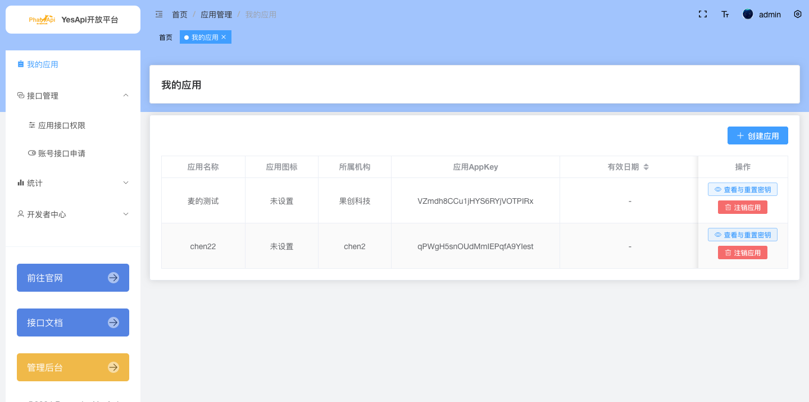
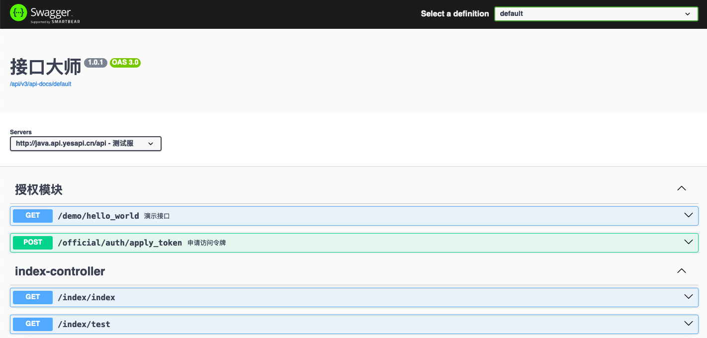

# YesApi Pro Java版 技术文档

## 简介

YesApi Pro Java版 是一套API管理平台及源代码， 基于主流的Java+MySQL+Vue3+Docker，是一套开发、管理和提供接口计费等功能的软件、源代码和解决方案。  

由 [果创科技-研发团队](http://www.goofuture.com/)自主设计和研发的软件系统，专业可靠，值得依赖！

## 访问环境

YesApi Pro Java版 包括 平台官网、API接口、管理后台和开放平台 等多个子系统，假设您的域名是：http://java.test.yesapi.cn，则：  

 + 平台首页：http://java.test.yesapi.cn/
 + 开放平台：http://java.test.yesapi.cn/platform/
 + 管理后台：http://java.test.yesapi.cn/admin/
 + API接口文档：http://java.api.yesapi.cn/api/swagger-ui/index.html#
 + 技术文档：http://java.test.yesapi.cn/wiki/

### 1、平台首页
平台官网以及首页，使用nuxtjs + element + typescript + pinia技术及架构，利于SEO和推广，可自定义多种主题模板，支持移动端响应式访问。  

### 2、Platform开放平台
提供给平台的开发者使用，可进行应用管理、查看接口权限等操作。基于Vue3开发，采用前后端分离技术方案，支持移动端响应式访问。  
  

### 3、Admin管理后台
提供给管理员使用，可进行全面的日常管理。基于Vue3开发，采用前后端分离技术方案，支持移动端响应式访问。  

### 4、API接口文档
基于Sping Boot 3 开发的API接口和微服务，基于Swagger搭建的在线接口文档，自动生成接口文档，自动映射到API的相应部分,提高了API文档的质量和可读性。  
  

### 5、技术文档
基于docsfiy前端框架搭建的Markdown在线文档，支持移动端响应式访问。

## 阅读对象

本技术文档主要面向YesApi Pro Java版的使用者，提供了关于技术开发、产品使用、业务介绍等内容，阅读对象包括但不限于后端开发人员、前端开发人员、测试人员、产品人员和运营人员。  

