# Admin管理后台产品使用手册  

使用管理后台之前，请先超级管理员创建分配管理员账号。  

> 适合阅读对象：管理员。  

# 登录   

## 访问管理后台

管理后台的地址是：[http://java.test.yesapi.cn/admin/](http://java.test.yesapi.cn/admin/) 

```
假设配置的域名是：http://java.test.yesapi.cn/  
```


## 登录管理后台

打开管理后台，首先需要进行管理员登录，登录界面如下：  

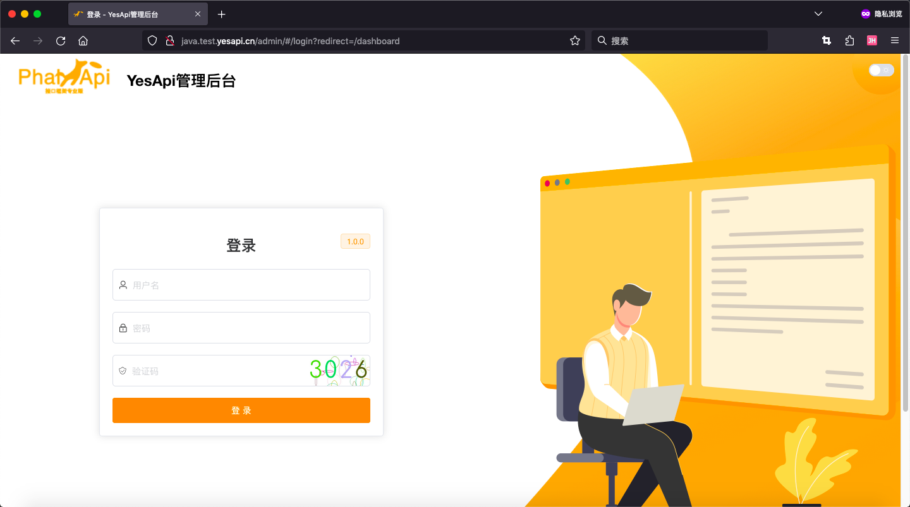  


# 后台首页  

进入管理后台后，可以看到类似以下的后台首页。其他功能模块，按界面指引操作即可。  

在后台首页，可以快速查看诸如：待审核应用、全部账号、今日接口请求次数、全部接口数量等整体概况。以及：接口流量统计图表、近期统计表格数据、昨日活跃App和系统授权信息等。  

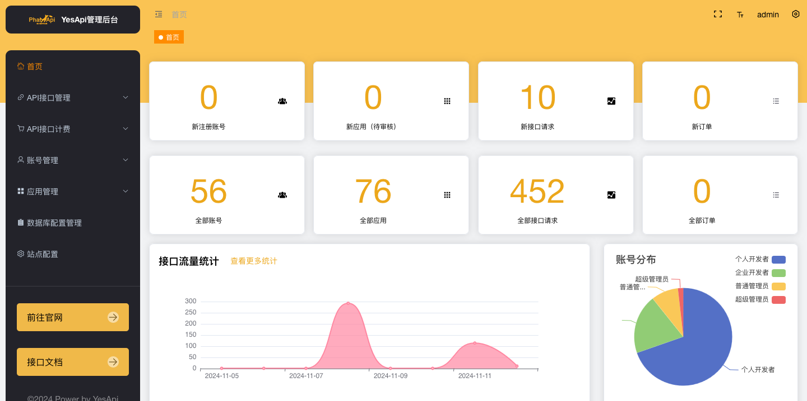  

其中，首页几个统计数据的口径是：    

 + 接口流量统计：根据接口请求日记实时统计最近30天的接口流量（排除开放平台和管理后台接口请求）  
 + 近期统计：按每日统计，包括：日期、订单总数量、应用总数量、用户总数量、活跃应用数量、UV、请求次数  
 + 昨日活跃App：包括：日期、App Key、活跃应用数量、UV、请求次数  

术语解释：  

 + 用户总数量：开发者账号数量+应用会员数量+管理员数量  
 + 活跃应用数量：当天有接口请求的App Key去重后数量    
 + UV：通过OpenAPI调用时所绑定关联的登录会员去重后数量  
 + 请求次数：指OpenAPI接口请求次数（不分成功与否，排除开放平台和管理后台接口请求）  

点击左侧功能菜单可以展开折叠菜单，和点击进入具体的功能界面。  

下面按功能模块简单介绍管理后台的功能和注意事项，最新的界面以最新版的为准。 

# API接口管理

## 接口权限

分别有：接口权限分配、接口权限规则设置、账号接口申请审核。  

其中，接口权限规则设置可以针对 接口服务操作， 授予权限给开发者角色、 开发者账号、 开发者应用。 维度越细，优先级越高。   

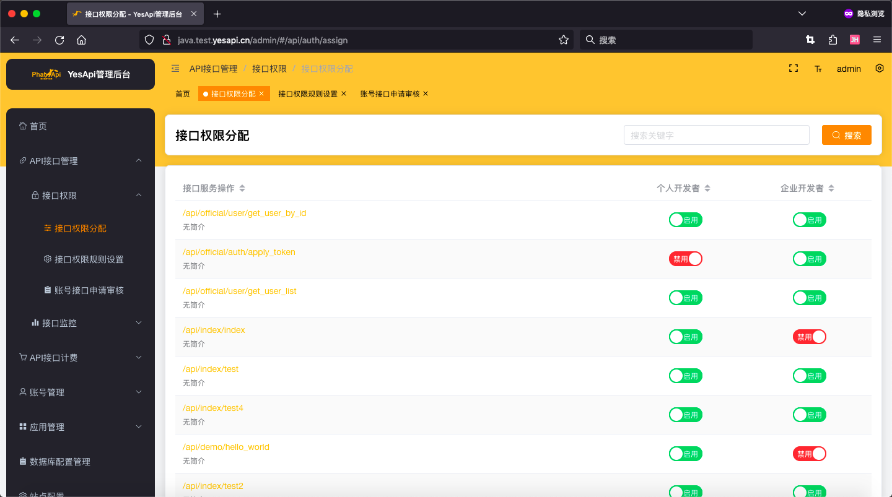  

## 接口监控

接口监控，分为：实时接口流量统计、每日接口统计、接口访问日志。  

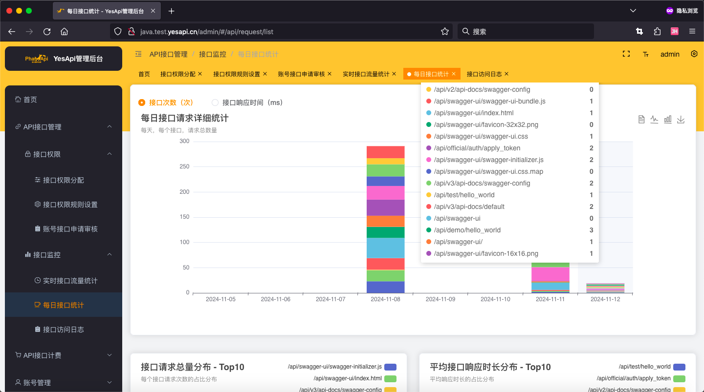  


# API接口计费

主要包括以下功能模块：接口流量套餐管理、订单管理、已购买的服务包管理。

## 支付配置
内置支付回调地址:
  * 支付宝：http://开发平台API域名/platform/notify/alipay_page_pay_notify
  * 微信支付：http://开发平台API域名/platform/notify/wechatpay_page_pay_notify
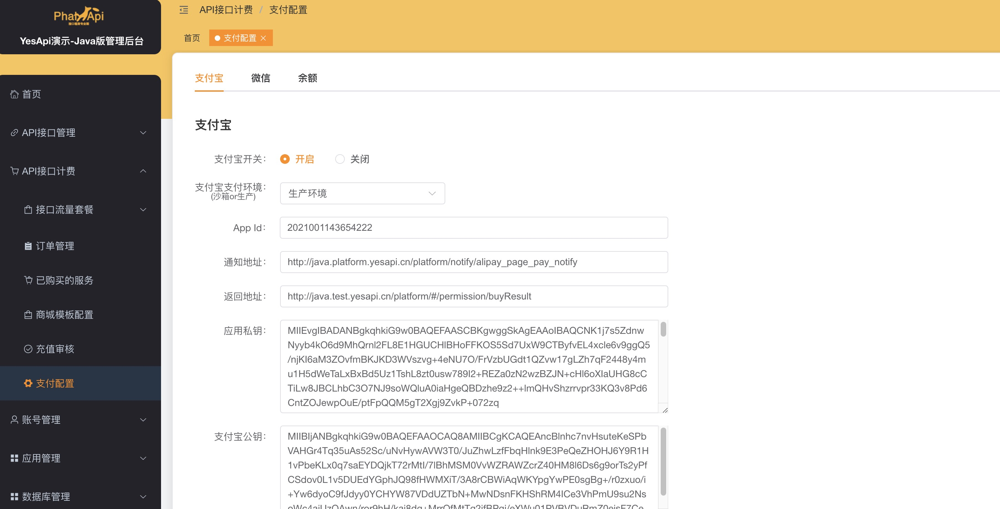

# 账号管理

账号的查看和管理，包括：开发者账号、管理员账号、普通用户账号等。也可以在管理后台直接添加新账号、重置密码、禁用账号等操作。  

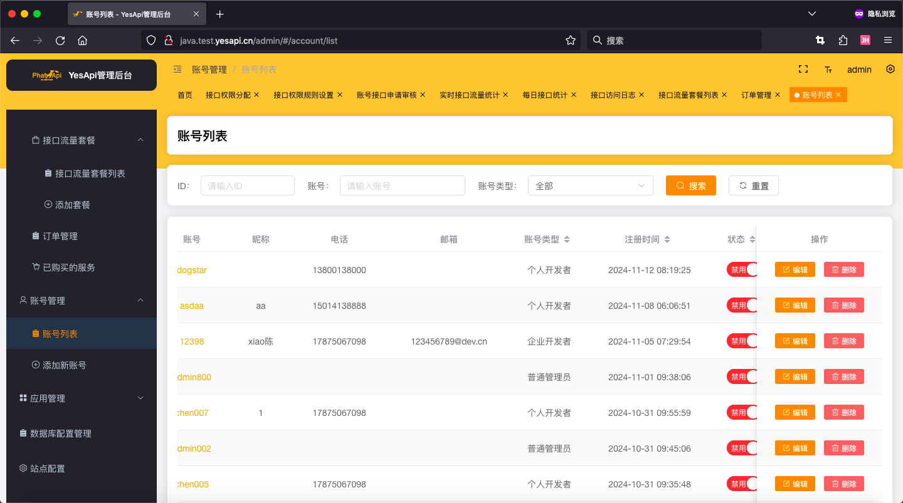  

# 应用管理

开发者应用的创建、查看、审核和管理。  

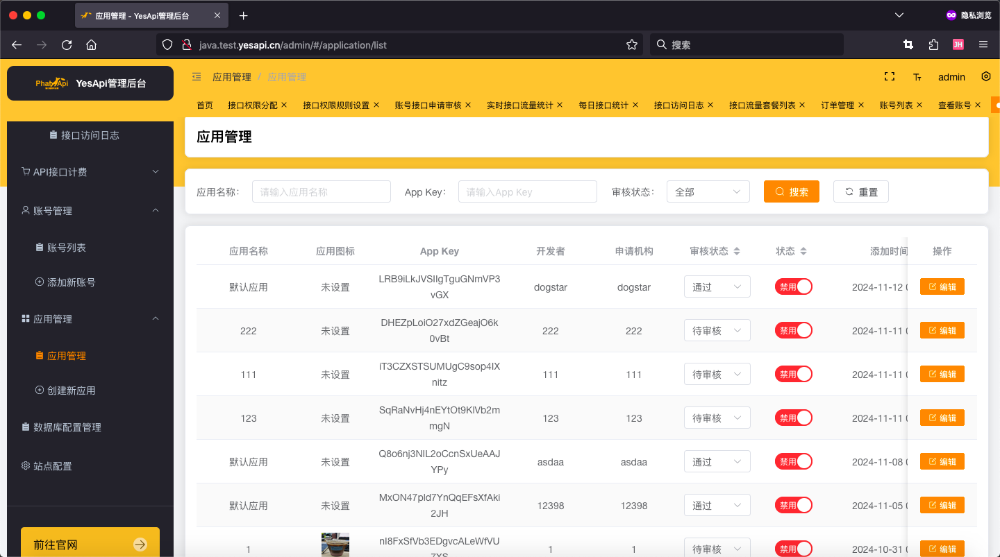  

对应用的管理，例如：修改应用名称、重置密钥等操作。  

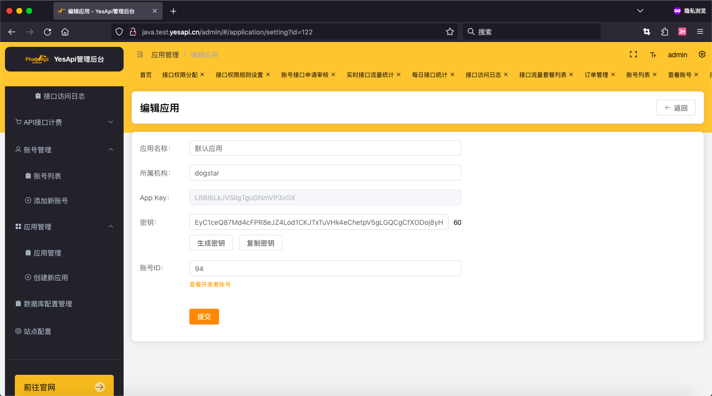

# 数据库配置管理

用于数据库连接的管理与配置。 

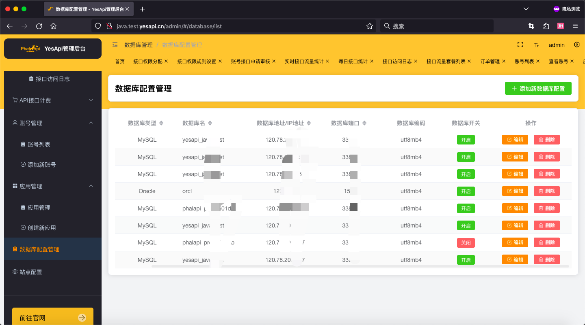  

# 站点配置

网站的全局配置，包括但不限于：  

 + 网站项目名称
 + Logo图片、Icon图标
 + 网站SEO设置
 + 底部备案号、备案跳转链接
 + 网站访问统计代码
 + 开发者注册和应用配置 等  
 
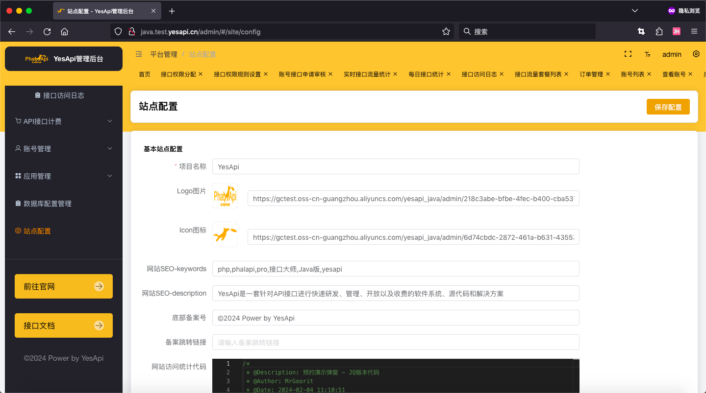  

# 我的

作为管理员个人的管理功能，有：  

 + 个人资料（查看和个人资料修改）  
 + 修改密码  
 + 退出登录  

  

# 移动版、黑夜模式和其他

你可以切换到黑夜模式，也可以使用手机移动端访问，还可以自己配置菜单布局方式。  


手机移动端访问效果：
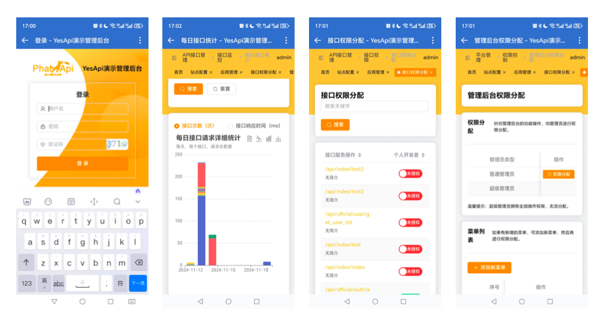   

