# 版本更新日记

> 温馨提示：如需补差价升级，或延长免费升级时间，可[联系我们](http://pro.yesapi.cn/)。  
> 

## YesApi Pro Java版 v3.0（2026-04）  
【全新UI升级】

 + 1、全新UI升级，美化你的接口门户平台，支持PC访问和手机移动端适配，并且兼容黑夜模式浏览；
 + 2、新接口门户首页：支持Banner轮播图、广告位配置、亮点介绍、热门API接口+免费试用接口+付费接口 三大版块、我们的优势、3分钟新手引导；新首页 （以下为UI设计稿效果，具体以实际为准）：
     
 + 3、新顶部导航：支持快速搜索API接口；
 + 4、新OpenAPI接口文档首页：支持分组筛选、支持价格分类筛选，支持三种接口列表显示风格：卡片式、列表式、表格式，支持按发布时间或价格进行排序；新接口列表页 （以下为UI设计稿效果，具体以实际为准）：
  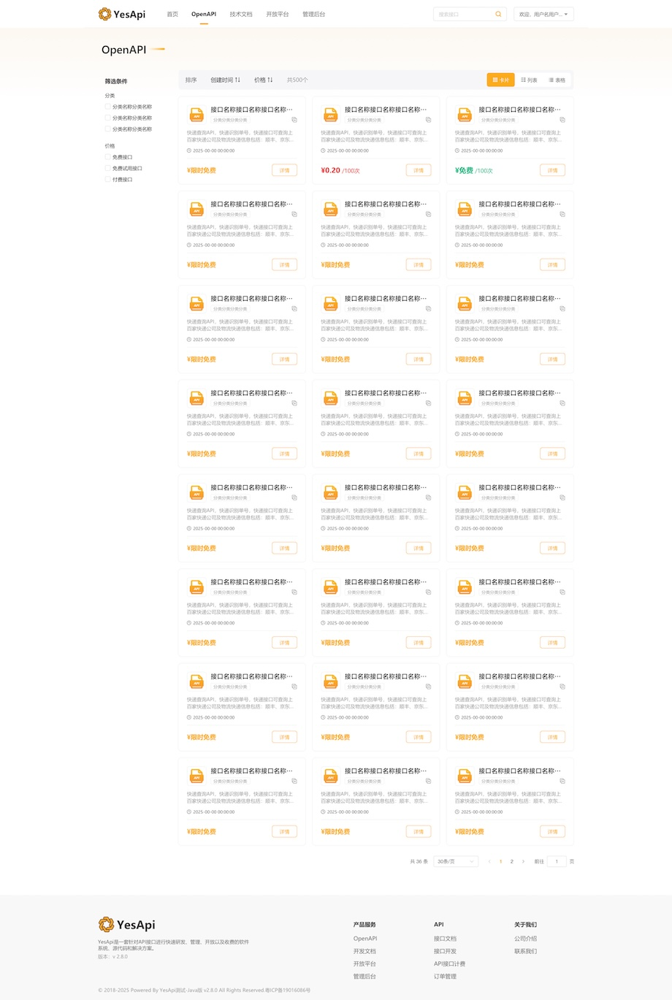   
 + 5、新接口文档详情：增加相关接口推荐模块，以及广告位展示；新接口文档详情页（以下为UI设计稿效果，具体以实际为准）
  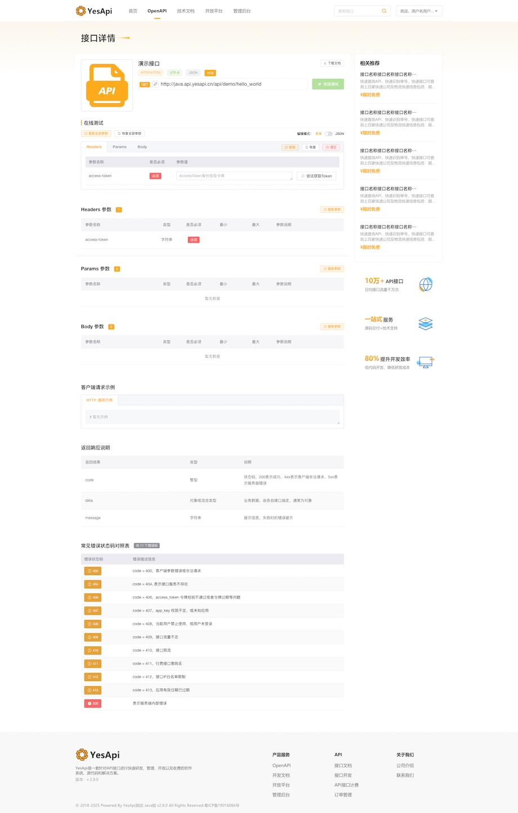  
 + 6、新管理后台登录界面；
  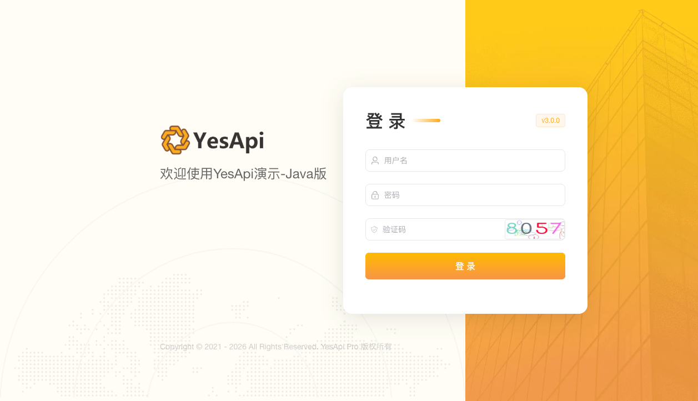    
 + 7、新开放平台登录界面；
  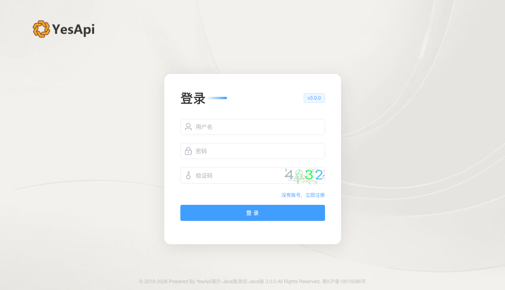   


## YesApi Pro Java版 v2.8.0（2026-01）  

【功能升级：】  
**1、新增：接口可视化编排，支持HTTP转发配置。**  
 + 管理后台： 
   - 新增：接口编排 模式。可进行接口可视化编排，增加“HTTP转发”新节点后，配置HTTP接口上游地址、接口参数和请求头等配置。  
   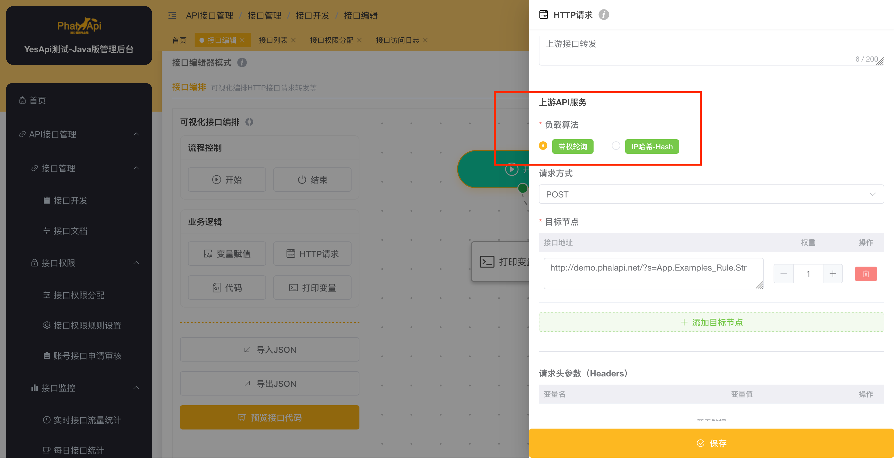  
 + 技术文档：
   - 新增文档：[可视化接口服务编排，HTTP转发](/apiflow-http-forward.md) 。
 + HTTP接口转发可视化编排发布后示例接口：
   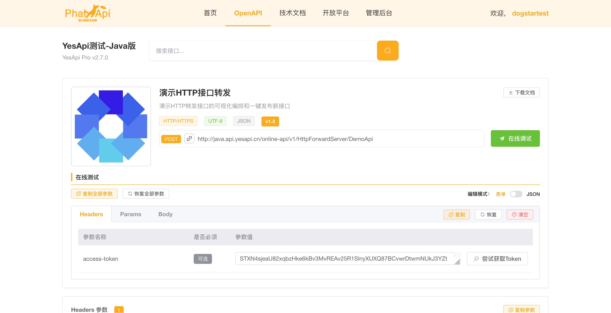  

**2、新增：接口文档-支持接口分组设置和前台显示**
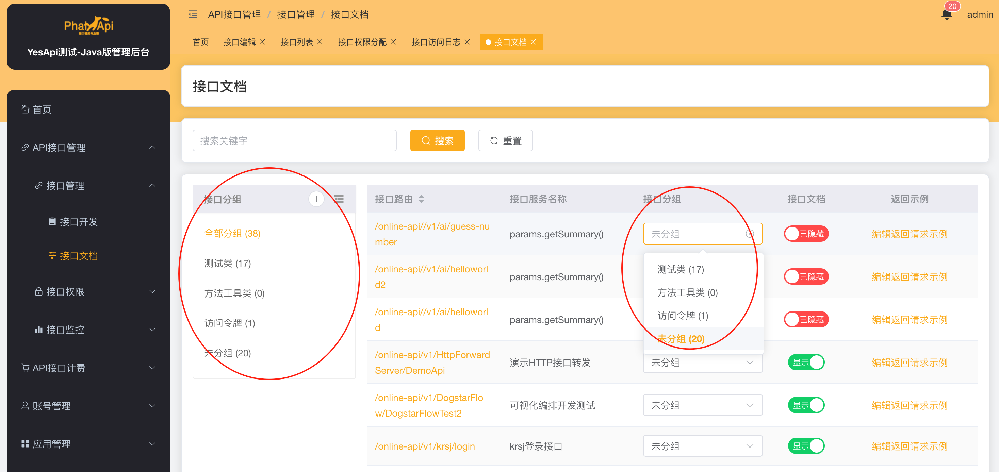  

**3、新增：管理后台-接口开发-支持批量操作（发布、开启/禁用、删除） **


## YesApi Pro Java版 v2.7.0（2025-07-15）  

【功能升级：】  
**1、新增：支持接口请求参数加密传输和接收解密，以及应用开关配置，灵活控制。**  

 + 管理后台： 
   - 新增：管理后台【应用管理】-【编辑应用】界面，增加支持【接口参数加密】开关控制，默认：关闭。  
    
 + 开放平台： 
   - 新增：开放平台【我的应用】-【加密配置】弹窗，增加支持【接口参数加密开关】开关的同步控制。  
   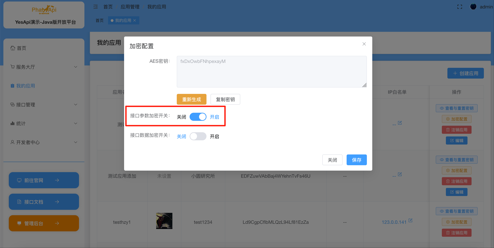 

**2、新增：针对接口的测试用例数据维护，支持Paramas、Body、Header的测试用例数据添加、使用和维护，方便管理后台快速测试接口。**  

 + 管理后台： 
   - 新增：【接口编辑】支持Paramas、Body、Header的测试用例数据添加、使用和维护。  
    

**3、新增：支持本地图片文件的上传，以及oss的切换。**  

 + 管理后台： 
   - 支持：本地图片文件的上传，以及oss的切换。对应nacos配置：  

```
aliyunoss:
  endpoint: 'oss-cn-guangzhou.aliyuncs.com'
  bucketName: gctest
  accessKeyId: xxxxxx
  accessKeySecret: xxxxxx
  folder: 'yesapi_java/admin/'
  host: ''
  isValidateType: true
  allowType:
    - image/jpeg
    - image/png
    - application/vnd.ms-excel
    - image/vnd.microsoft.icon
  allowSize: 10

local:
  storageFolder: /www/app/file/

file:
  accessUrl: http://xxx/files/
```

**4、新增：YesAPI接口平台的SDK，下载和示例使用。主要用于：设置接口域名、申请获取令牌Token、以及接口请求调用和返回结果。**  

 + Wiki开发文档：增加【[SDK客户端](/sdk.md)】 ，包括：curl、Java、Python、Golang、PHP、Nodejs、C-sharp等语言的SDK包。  

**5、UI升级：OpenAPI接口列表，升级扩展支持：卡片、列表、表格 三种展示方式，支持分页、价格排序、接口检索等操作。**
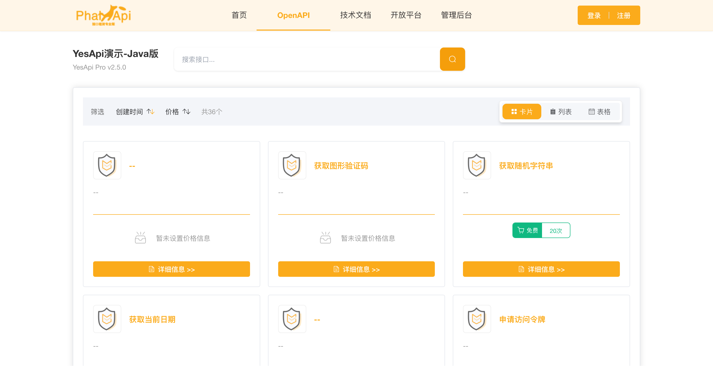  

**6、升级：管理后台接口权限分配，支持批量操作，批量选中API接口路由，以及批量授权给开发者账号，同时支持快速搜索。**  
  

**7、新增：站内消息通知中心。**

 + 管理后台： 
   - 新增：管理后台【消息通知中心】，管理员共享查看未读消息通知，以及各类型的新消息通知的数量统计，查看处理和全部标识已读。  
   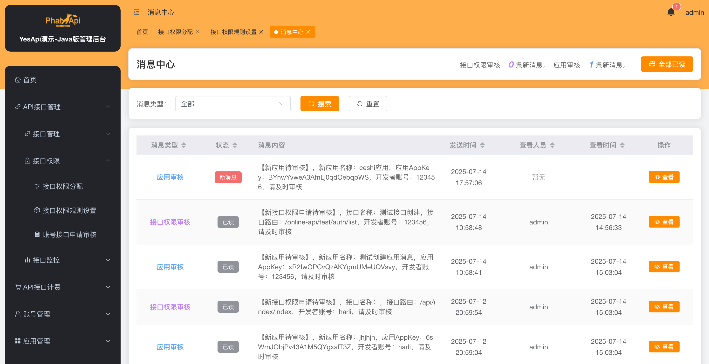 
 + 开放平台： 
   - 新增：开放平台【我的消息】，开发者查看我的新消息未读数量、消息通知内容以及全部标识已读。  
   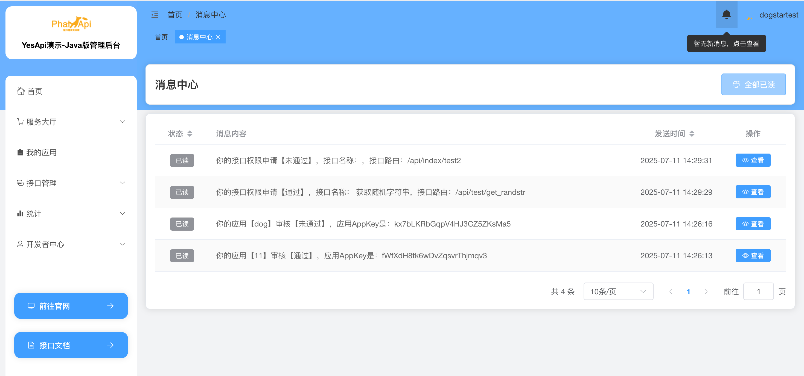 

## YesApi Pro Java版 v2.6.0（2025-06-12）  

【功能升级：】  
**1、新增：Java版在线接口开发，快速开发数据库api接口、发起http请求，一键在线发布成HTTP新接口**

 + 管理后台：  
   - 新增：管理后台【接口开发】模块，提供后台对于API接口列表的管理、添加新接口和搜索查看，和发布管理。  
   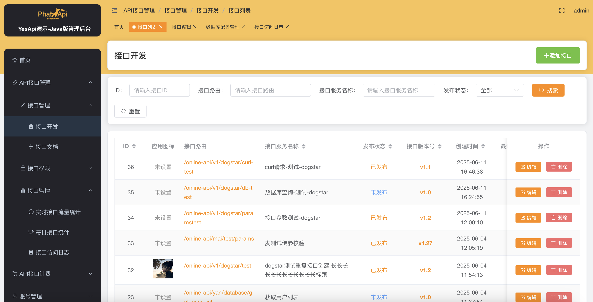 
   - 新增：管理后台【接口开发】-【在线接口开发】，提供在线接口代码编辑器，支持语法检测、高亮、缩进对齐、提示等。  
   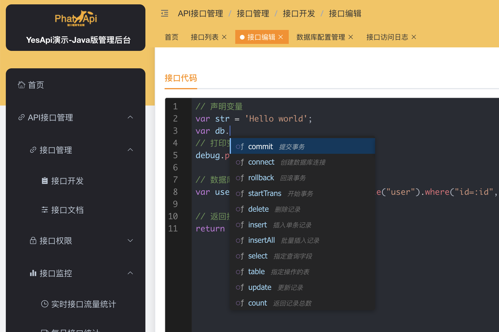 
   - 新增：管理后台【接口开发】-【在线接口设计】，支持接口参数的添加、header设置、body请求参数的配置，以及测试数据维护等。  
   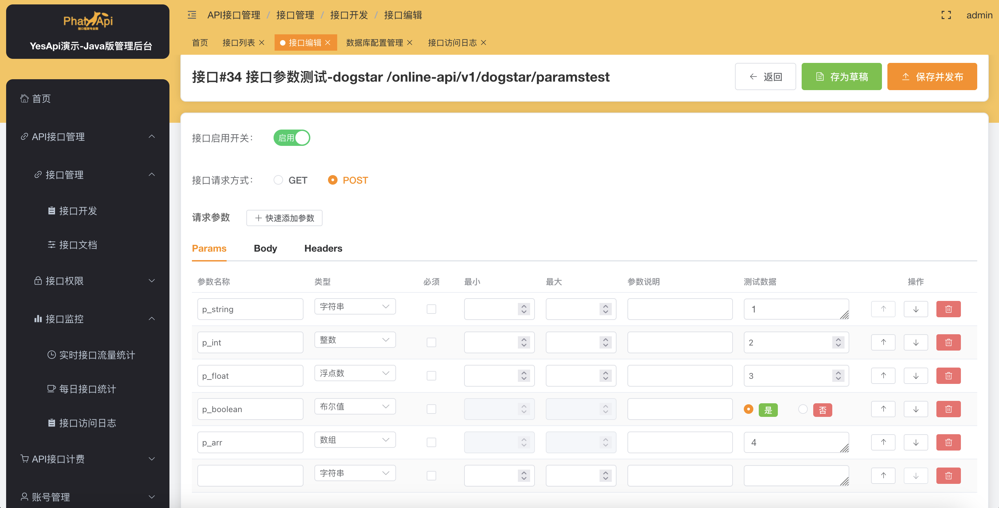 
   - 新增：管理后台【接口开发】-【在线接口调试】，即时调试，支持打印变量、查看语法报错、异常堆栈、SQL执行语句、接口响应时间等开发调试信息。  
   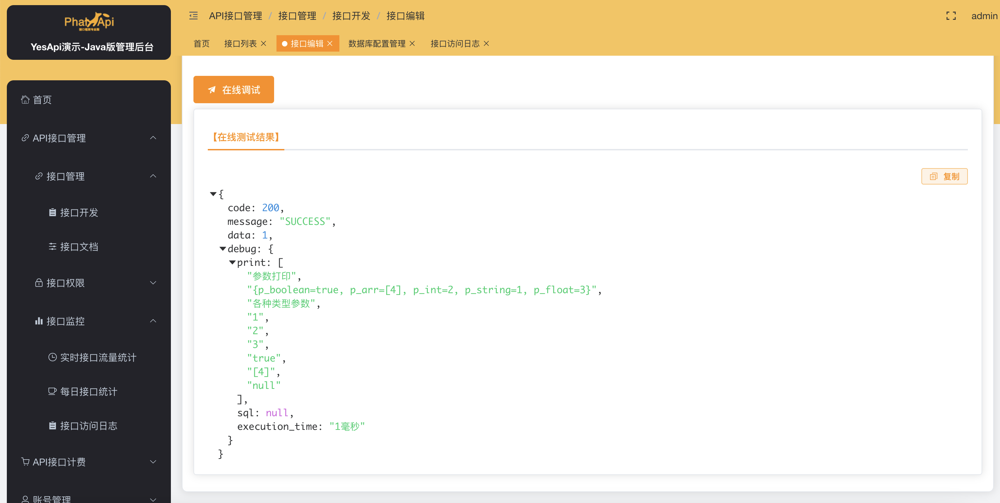 
   - 新增：管理后台【接口开发】-【接口发布管理】，接口启用/禁用控制、接口版本控制、接口图标、接口描述、接口标题名称、接口发布记录查看、接口路由设计、接口请求方式等。  
   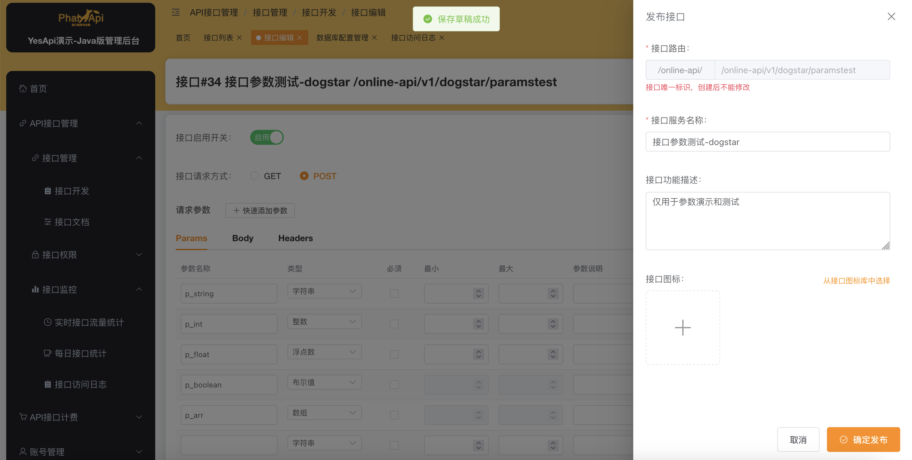 


**2、升级：在线接口文档和接口测试全面升级增强开发体验**

 + 在线接口文档：  
   - 升级：界面美化，以及增加header、params、body等接口参数的展示。  
   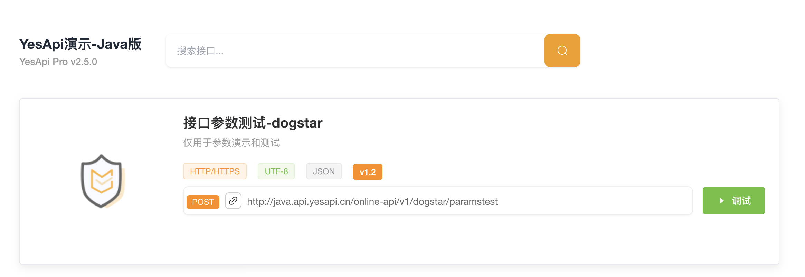 
   - 增强：接口在线测试能力，增加 复制全部参数、恢复全部参数、编辑模式支持 json/表单、复制当前参数、清空参数；复制接口链接；接口版本号显示；。  
   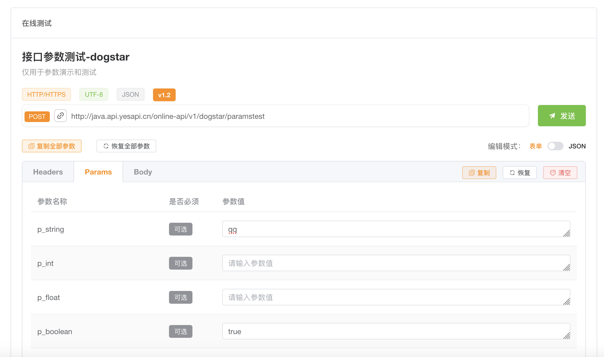 

**3、增加：在线接口开发引擎**

 + API引擎：  
   - 新增：基于magic-script的在线核心API脚本引擎及执行、调试；
   - 新增：Java版动态数据库的封装，支持MySQL/Oracel等oovr库（异常处理、sql语句日志、在线调试、接口调用等） ；
   - 新增：curl动态请求HTTP接口的封装；
   - 新增：完整的在线接口开发文档，包括：在线接口开发的基础语法、接口参数、数据库使用、Curl使用、内置模块、注意开发事项。
   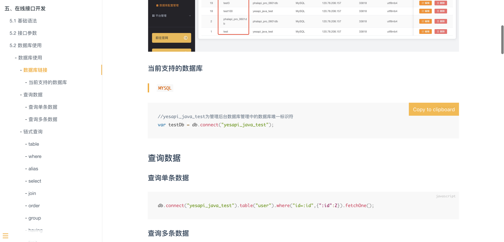  

**4、增加：接口IP黑名单配置以及拦截**


## YesApi Pro Java版 v2.5.0（2025-05-10）  
【功能升级：】  
**1、新增： OpenAPI接口内容脱敏加密：data接口返回数据AES加密，每个应用单独密钥，支持多种客户端开发语言解密**  

 + 开放平台： 
   - 新增：应用加密配置，支持：AES密钥重新生成、接口数据加密开关；  
   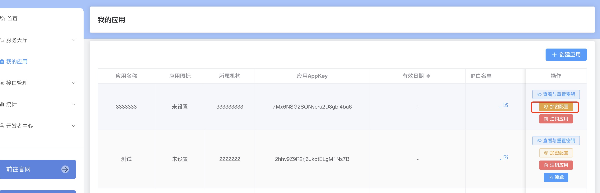  
   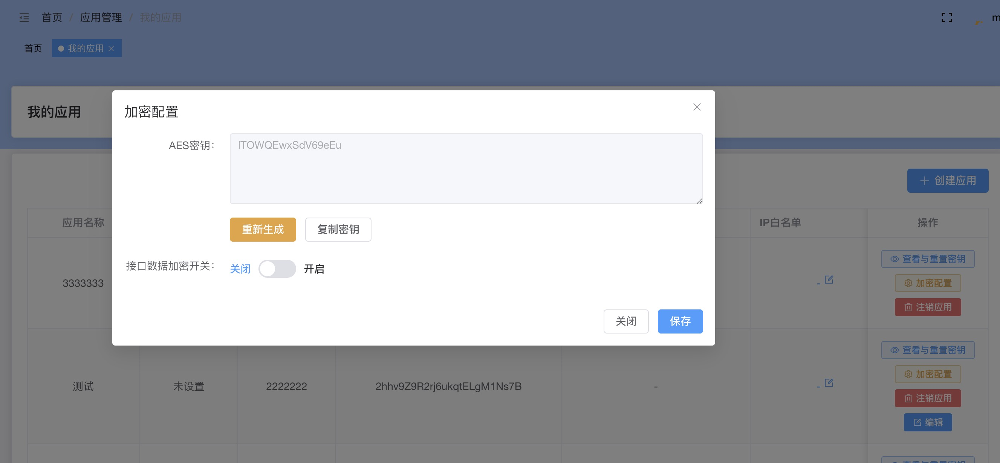  
 + 管理后台：  
   - 新增：管理后台的【应用管理】，进入【编辑】后重置 应用的密钥，开启或关闭接口数据加密，保存后立即生效。  
    
 + API平台： 
   - 新增：OpenAPI接口返回数据data的加密。  
   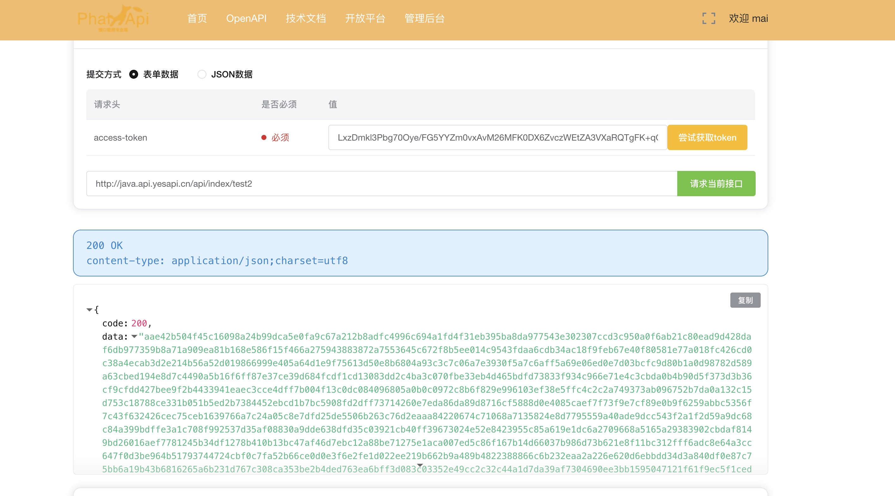  
 + 文档：
   - 新增：[3.2 接口返回数据加密](/2x-return-data-encrypt.md)。   

**2、新增： 数据报表统计，每日平台统计汇总数据**  

 + 管理后台：  
   - 新增：在【平台管理】，新增【统计报表】模块，以及【每日平台统计】新菜单，统计每日数据：  
   新账号、新应用、新订单、当天接口请求、全部账号、全部应用、全部订单、全部订单支付金额（元）、全部账号余额（元）。  
   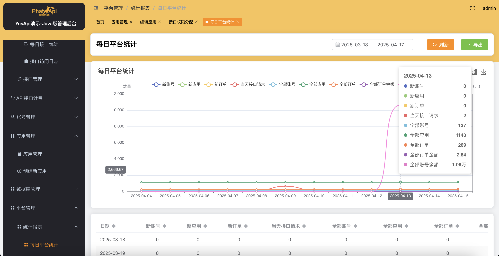   
   - 新增：支持Excel导出平台每日统计数据。  
   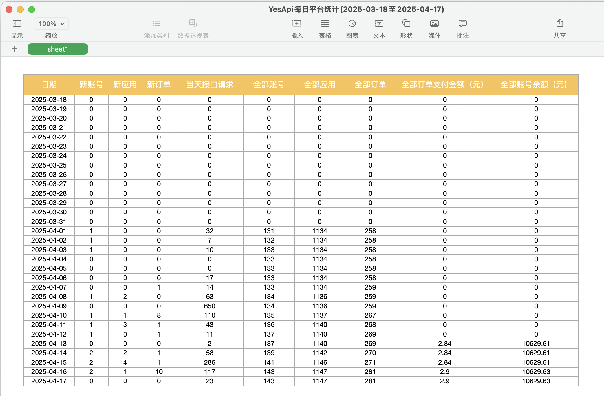   

**3、优化： 统一文案，接口路由、接口地址、接口名称、接口套餐 等**  

以下是YesApi Pro版本的统一术语定义：  

| **术语**          | **定义**                                                                 | **示例**                              |  
|---|---|---|  
| 接口服务名称      | 接口中文标题名称，简要描述接口功能或用途。                                      | 订单查询接口                     |  
| 接口功能描述      | 用于描述接口功能或用途。                                      | 关于接口功能的一段文字内容描述。                     |  
| 接口路由          | 接口的访问相对路径，用于定位接口功能，唯一标识不同的接口服务。                                        | `/api/user/profile`                  |  
| 接口套餐名称          | 接口服务的购买套餐，有时简称：套餐名称，涵盖余额充值等订单套餐。                                            | 对应管理后台配置的接口套餐名称，例如：接口流量包套餐名称、组合优惠套餐名称、接口免费试用套餐名称等。                     |  
| 接口请求地址      | 接口的完整访问请求地址，包含域名和路由和参数，主要是提供给客户端程序调用。                                | `https://api.yesapi.cn/api/user/profile` |  
| 接口请求方式      | 接口的HTTP请求方式。                                | 例如：GET、POST |  


**4、优化：管理后台，开发者ID，改成 开发者下拉列表组件，方便账号搜索**  


## YesApi Pro Java版 v2.4.0（2025-04-11）
【功能升级：】  
**1、新增：余额充值与余额支付方式，以及管理后台的充值审核；**  

 + 开放平台： 
   - 开放平台显示用户账号余额；
   - 开放平台新增【余额充值】，在线充值余额到开发者账号；
   
   
   - 开放平台-我的订单，扩展显示余额充值的订单，可对未充值的订单进行重新在线支付；
   - 开放平台，购买接口套餐，支持使用余额支付方式；
   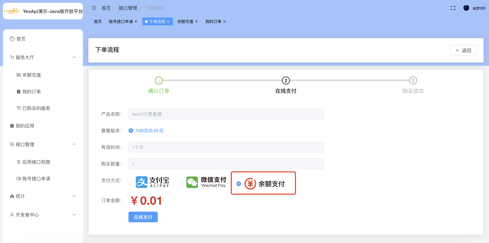

 + 管理后台：  
   - 新增：管理后台-支付配置，可以在线管理和配置微信支付、支付宝支付、余额支付，只有超级管理员才有权限进行修改；
   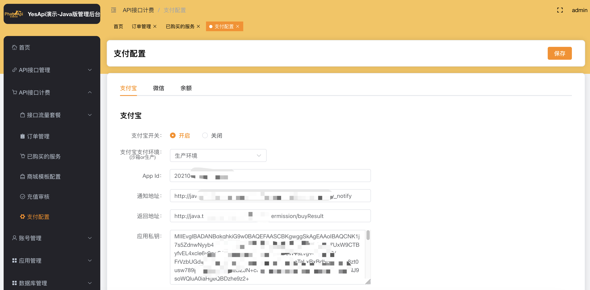
   - 新增：管理后台在账号管理新增 账号余额卡版，以及【充值申请】入口，适合线下充值和对公转账使用；
   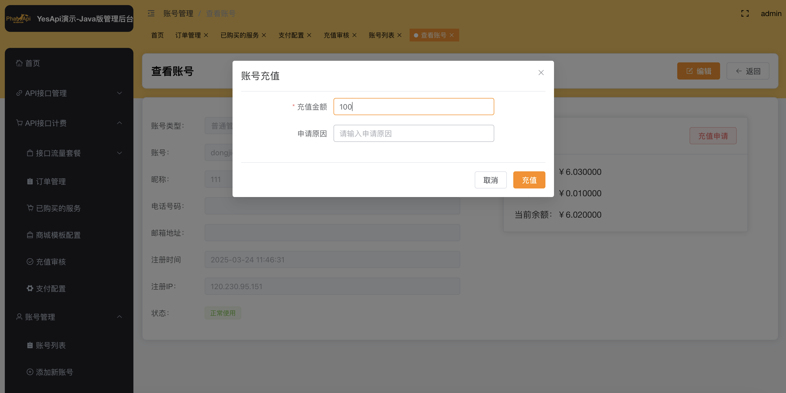
   - 新增：管理后台【充值审核】新菜单，只有超级管理员才有权限进行审批；
   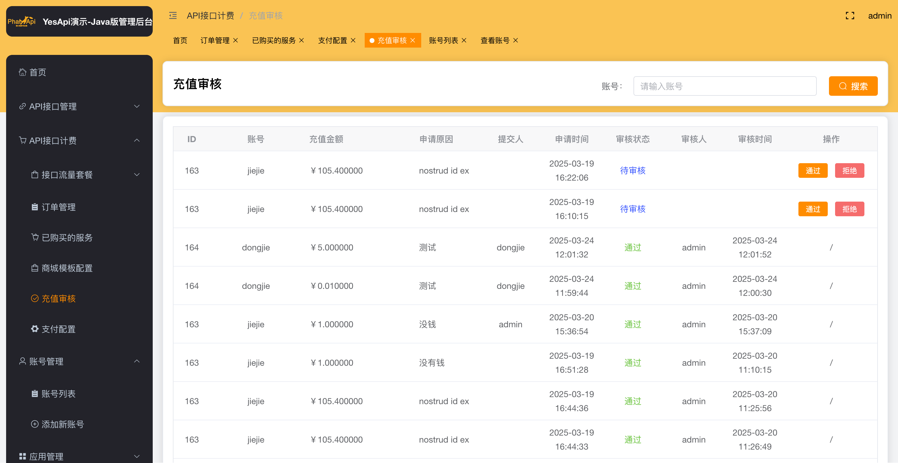
   - 管理后台-订单管理，扩展显示余额充值的订单；

**2、新增：接口文档显示/隐藏控制，隐藏后，接口文档和套餐已隐藏，接口调用不受影响。**  
 + 管理后台：  
   - 新增：管理后台-接口管理-接口文档，新增 接口文档显示/隐藏 操作；  
   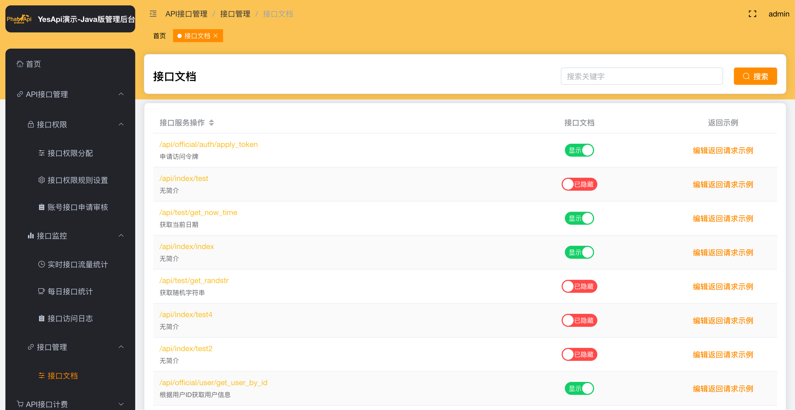  

 + 开放平台： 
   - 开放平台-应用接口权限、账号接口申请，同步隐藏/显示接口；

 + API平台： 
   - 平台首页：免费接口、免费试用接口、付费接口，同步隐藏接口及其套餐；  
   - 接口列表页：同步隐藏接口列表、搜索、和购买入口；  
   - 接口详情页：接口文档隐藏提示，全部免费试用、购买入口，暂时保持不变；
   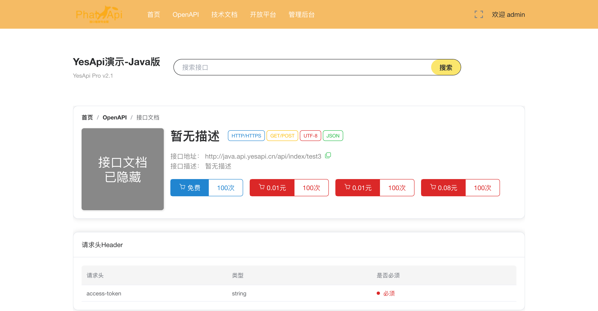  

**3、新增：接口应用IP白名单配置、和应用有效日期设置。**  
 + 管理后台：  
   - 新增：管理后台-应用管理-编辑应用，新增 IP白名单、有效日期（年月日） 配置；  
   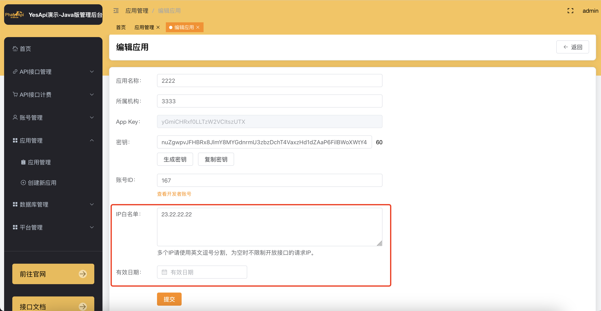  

 + 开放平台： 
   - 开放平台-我的应用，添加 IP白名单配置修改，以及 有效日期 显示查看；  
   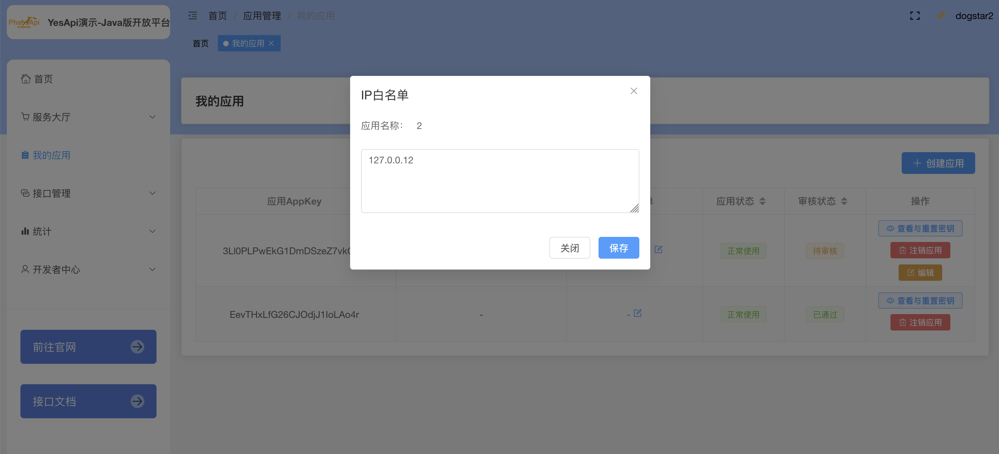  

 + API平台： 
   - OpenAPI及接口详情页：扩展错误状态码 code=412，接口IP白名单限制、code=413，应用有效日期已过期；  

**4、优化：开放平台和管理后台，报表统计和优化。**  
 + 接口状态码code统计。  
 + 每日接口统计改用定时任务的统计报表，提升查询速度。  
 + 管理后台-首页-近期统计（显示：新账号、新应用、新订单、接口请求）。  
 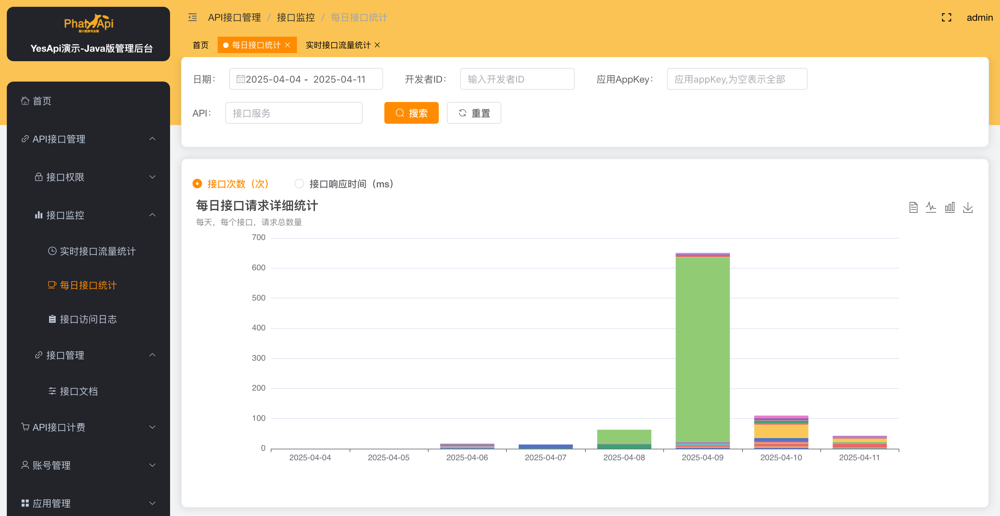  


## YesApi Pro Java版 v2.3.0（2025-03-07）

 + 平台官网： 
   - 接口文档详情页，增加：接口在线测试，支持 表单格式/JSON 格式两种参数提交方式；
   - 首页：增加可配置的Banner图和三个广告图位；
   - 统计脚本和底部优化：优化统计脚本、以及可配置 备案号和跳转链接等；

 + 管理后台： 
   - 新增：商城模板配置（多个首页广告轮播图、以及三个 推荐广告图）；   
   - 新增：接口文档管理，支持接口返回示例配置，提供：HTTP、cURL、PHP、Javascript、Java、Python、C#、Golang 语言栏位配置；

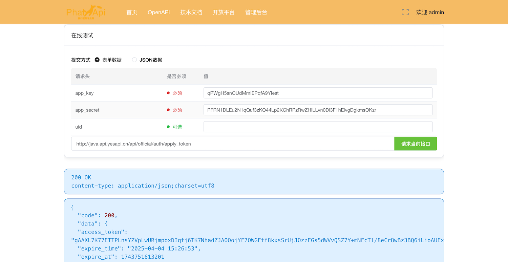  
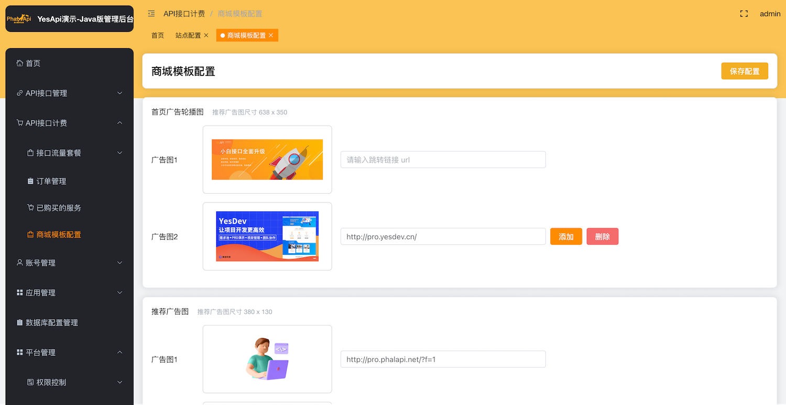  
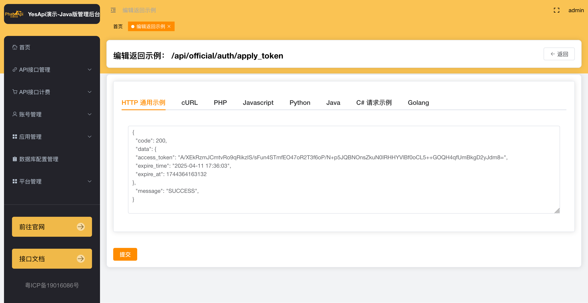  

## YesApi Pro Java版 v2.2.0（2025-02-28）

 + 开放平台
   - 新增：在线支付支持微信支付；

  
   

## YesApi Pro Java版 v2.1.0（2025-02-18）

v2.1版本，主要实现接口商城主题模板的展示，重点用于接口计费套餐的购买。包括：新平台首页、新接口列表页、新接口文档详情页。  

 + 平台官网：  
   - 新平台首页（分为免费接口、热门接口、付费接口三大模块，以及Banner等模块）；  
   - 新接口列表页（提供：购买入口，及免费试用说明），支持接口搜索；  
   - 新接口文档详情页（提供：购买入口，及免费试用说明，以及接口说明和请求地址）； 
   - 接口详情参数升级，返回更多接口参数信息（统一用 Javax.Validation注解，以及返回 默认值、长度限制、最大值、最小值、参数说明和其他 等）；

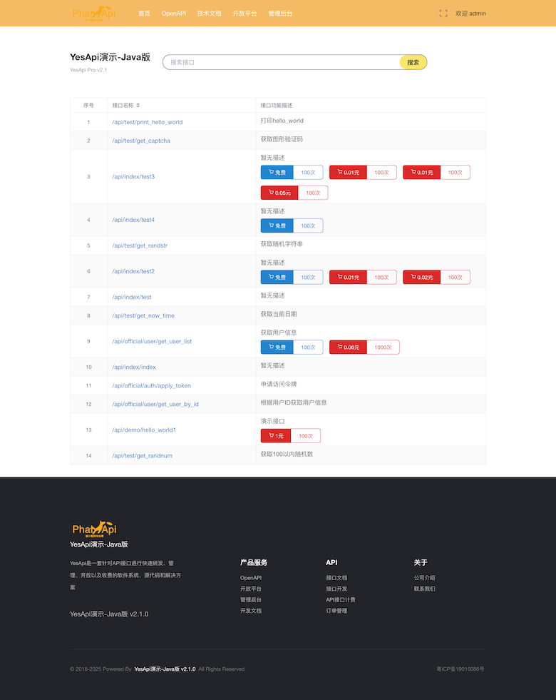  

## YesApi Pro Java版 v2.0.0（2024-11）

v2.0版本，主要实现API接口计费功能，打造您的API接口收费平台和服务平台。核心实现：后台接口流量套餐配置+开发平台下单购买+在线支付（支付宝/微信支付/现金支付）+接口计费。  

 + API接口系统：  
    - API接口扣费逻辑
    - API接口日记与账单

 + 开放平台：  
    - 接口流量包购买
    - 下单流程（创建订单、在线支付、购买成功）
    - 服役大厅：我的订单、我的流量包

 + 管理后台：  
    - 接口流量套餐配置
    - 订单管理
    - 已购服务包管理

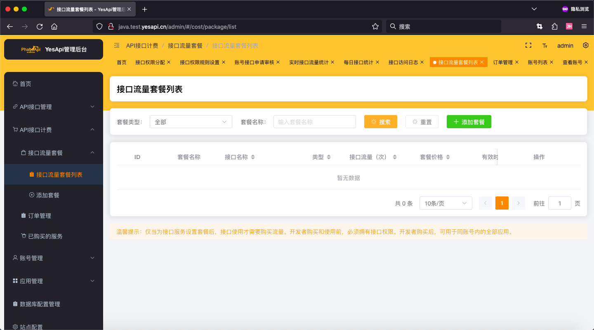  

## YesApi Pro Java版 v1.0.0（2024-10）

YesApi Pro Java版第一个Beta内测版本，研发提供：平台官网、API接口、管理后台和开放平台 等多个子系统，例如：  

 + 平台首页：http://java.test.yesapi.cn/
 + 开放平台：http://java.test.yesapi.cn/platform/
 + 管理后台：http://java.test.yesapi.cn/admin/
 + API接口文档：http://java.api.yesapi.cn/api/swagger-ui/index.html#
 + 技术文档：http://java.test.yesapi.cn/wiki/

重点打造搭建Java版的接口管理平台、接口开放平台。  

  
  
   

