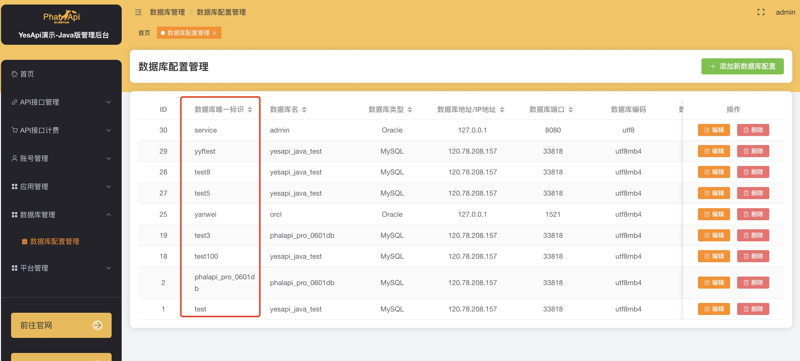

## 数据库使用

数据库使用（db模块）在接口开发中是比较常见场景，所以db模块作为默认加载的模块。db模块设计参考ThinkORM，采用链式调用，支持原生查询和事务。


### 数据库链接

数据库的链接非常简单，与管理后台的数据库管理功能相互配合，可以扩展和链接更多的数据库。




#### 当前支持的数据库

> `MYSQL`  


```javascript
//yesapi_java_test为管理后台数据库管理中的数据库唯一标识符
var testDb = db.connect("yesapi_java_test");  
```


### 查询数据

#### 查询单条数据

```javascript
db.connect("yesapi_java_test").table("user").where("id=:id",{":id":2}).fetchOne();
```

#### 查询多条数据

```javascript
db.connect("yesapi_java_test").table("user").fetchAll();
```


### 链式查询 

#### table

指定操作的表，可以忽略表前缀，自动填充数据库管理中的表前缀。

```javascript
db.connect("yesapi_java_test").table("user").fetchAll();
```


#### where

查询条件，使用直接写完整的字符串where条件，为传入变量和提升安全性，提供【:xxx】占位符方式。

```javascript
//方式一 直接写普通的where条件
db.connect("yesapi_java_test").where("id=2").fetchOne();
//方式二 通过占位符和传入map
db.connect("yesapi_java_test").where("id>:id AND age>18",{":id":2}).fetchOne();
```


#### alias

主表别名

```javascript
db.connect("yesapi_java_test").table("app").alias('a').join(["user","u","a.uid=u.id"]).fetchAll();
```


#### select

查询字段，多个用英文逗号隔开

```javascript
db.connect("yesapi_java_test").table("app").select("app_key").fetchAll();
```


#### join

联表，数组格式["表名（可省略表前缀）","别名","ON条件"]，如果有多个，则传入多个数组，用英文逗号隔开

```javascript
//联一个表
db.connect("yesapi_java_test").table("app").alias('a').select("a.app_key,u.id,u.username").join(["user","u","a.uid=u.id"]).where("a.id>:id",{":id":1}).fetchAll();

//联多个表
.join(["user","u","a.uid=u.id"],["user1","u1","a.uid=u1.uid"]);
```


#### order

排序

```javascript
db.connect("yesapi_java_test").table("user").order("age DESC,id ASC").fetchAll();
```


#### group

分组

```javascript
db.connect("yesapi_java_test").table("user").select("age,count(id) as num").group("age").fetchAll();
```


#### having

配合group方法完成从分组的结果中筛选

```javascript
db.connect("yesapi_java_test").table("user").select("age,count(id) as num").group("age").having("age>18")fetchAll();
```


#### limit

返回条数限制  limit(起始条数,返回条数)

```javascript
db.connect("yesapi_java_test").table("user").limit(0,10).fetchAll();
```


### 分页

用于分页查询，page(页码,页数)

```javascript
var data = db.connect("yesapi_java_test").table("app").alias('a').select("a.app_key,u.id,u.username").join(["user","u","a.uid=u.id"]).where("a.id>:id",{":id":1});
var total = data.count();
var list = data.order("u.id DESC").page(1,10);
```


### 计算总和

用户统计总数,返回正整数

```javascript
db.connect("yesapi_java_test").table("user").count();
```


### 添加数据

```javascript
//添加单条数据,返回添加后该条数据的自增ID
db.connect("yesapi_java_test").table("user").insert({name:"mai",age:30});
//添加多条数据，返回添加成功的条数
db.connect("yesapi_java_test").table("user").insertAll({name:"mai",age:30},{name:"tom",age:25});
```


### 更新数据

更新数据，如果需要字段的自增自减，则在传入值头部加上【expr:】

```javascript
db.connect("yesapi_java_test").table("user").where("id=:id",{":id":2}).update({name:"maixiaohan",age:"expr:age+1"});
```


### 删除数据

```javascript
db.connect("yesapi_java_test").table("user").where("id=1").delete();
```


### 事务操作

事务操作分为三部分，开启事务、提交事务、回滚事务

> 使用事务处理的话，需要数据库引擎支持事务处理。比如 `MySQL` 的 `MyISAM` 不支持事务处理，需要使用 `InnoDB` 引擎。

```javascript
var userDb = db.connect("yesapi_java_test");
//开启事务
userDb.startTrans();
var data = userDb.table("user").where("id=:id",{":id":2}).update({name:"maixiaohan",age:"expr:age+1"});
if(xxx){ 
  //提交事务
	userDb.commit();
}else{
  //回滚事务
  userDb.rollback();
}
```


### 原生查询

```javascript
db.connect("yesapi_java_test").query("SELECT * FROM xx_user");
```


### 获取查询语句

返回链式操作后的查询语句，可用于查询日志记录或者调试

```javascript
db.connect("yesapi_java_test").table("app").alias('a').select("a.app_key,u.id,u.username").join(["user","u","a.uid=u.id"]).where("a.id>:id",{":id":1}).getSql();
```

