# Platform开放平台使用手册

开放平台是提供给开发者使用的平台。  

> 适合阅读对象：开发者/用户。  

# 使用流程和访问
新手开发者的主要使用流程是：  

 + 第一步、注册开发平台，并登录
 + 第二步、创建新应用，并等待管理后台审核通过
 + 第三步、根据应用的app_key和密钥，申请新的令牌
 + 第四步、使用令牌，调用API开放接口
 + 第五步、结合OpenAPI，开发自己的应用

## 访问开放平台

开放后台的地址是：[http://java.test.yesapi.cn/platform/](http://java.test.yesapi.cn/platform/) 
```
假设配置的域名是：http://java.test.yesapi.cn/
```

或者通过官网的导航菜单，点击【登录】/【注册】跳转进入开放平台。  

# 注册和登录

## 注册开发者账号

进入开发者注册页面，按提示填写注册信息，然后提交。  

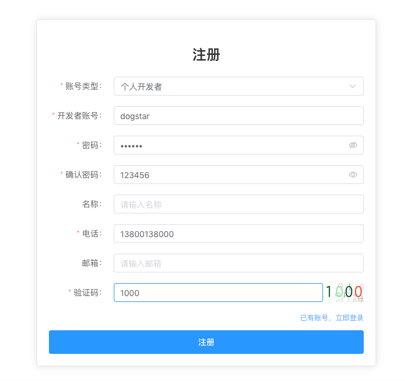  


## 登录开放平台

注册成功后，进入开放平台登录页面，输入登录账号和密码，然后登录。  

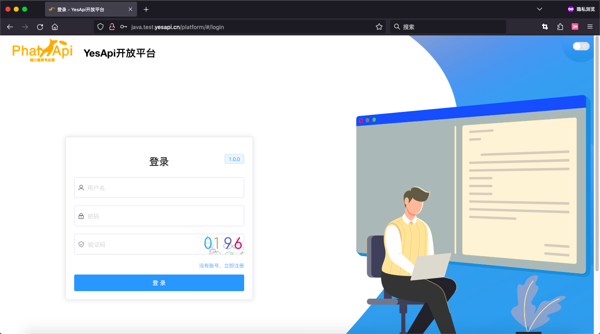  

## 开放平台首页

在开放平台tudm，可以查看到概况统计、我的应用、接口管理、开发者中心、接口流量统计图表和表格数据、已提交的工单等概要信息。  

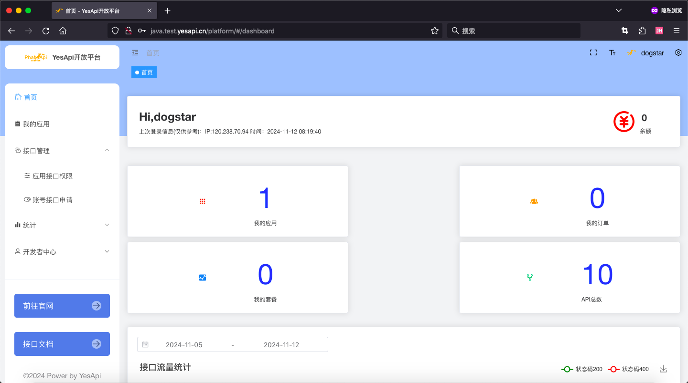  


# 应用管理

## 创建我的应用

进入【应用管理】-【我的应用】-【创建新应用】，按要求填写相关信息，确认提交，然后等待管理员审核。  

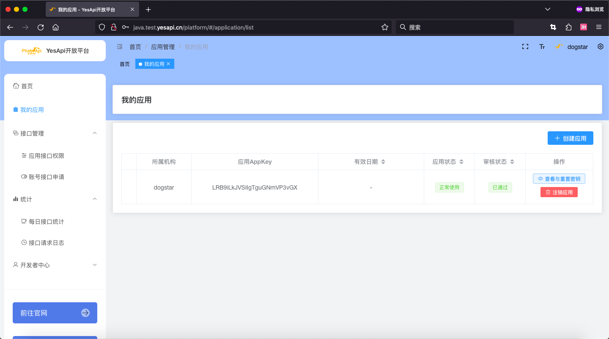  

填写应用信息：  
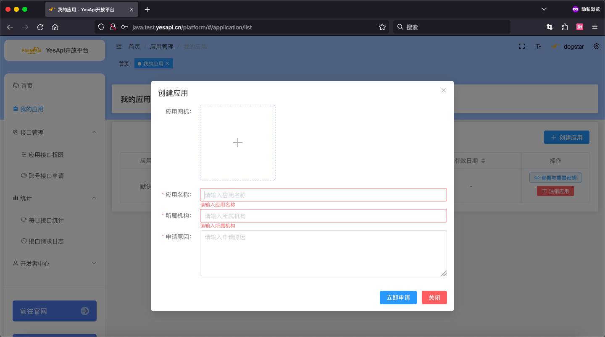  

创建新应用后等待管理员审核并，查看已经成功申请的应用密钥：  

除了密钥，你还可以查看自己应用的其他信息，包括但不限于：  

 + 应用图标
 + 应用名称
 + 应用AppKey
 + 有效日期（为空时表示不限制）  
 + 应用状态（正常使用/注销/禁用）  
 + 审核状态（待审核/已通过/未通过） 
 + 所属机构   

应用审核通过后，可查看应用的接口权限。  

# 接口管理

在管理员分配接口权限后，就可以调用需要的开放接口API。  

## 应用接口权限

在 接口权限 页面，可以选择和切换自己的应用，搜索和查看 已获得的接口权限，或 未获得的接口权限，或全部接口。  

对于需要付费才能调用的接口，可以在线立即购买。  

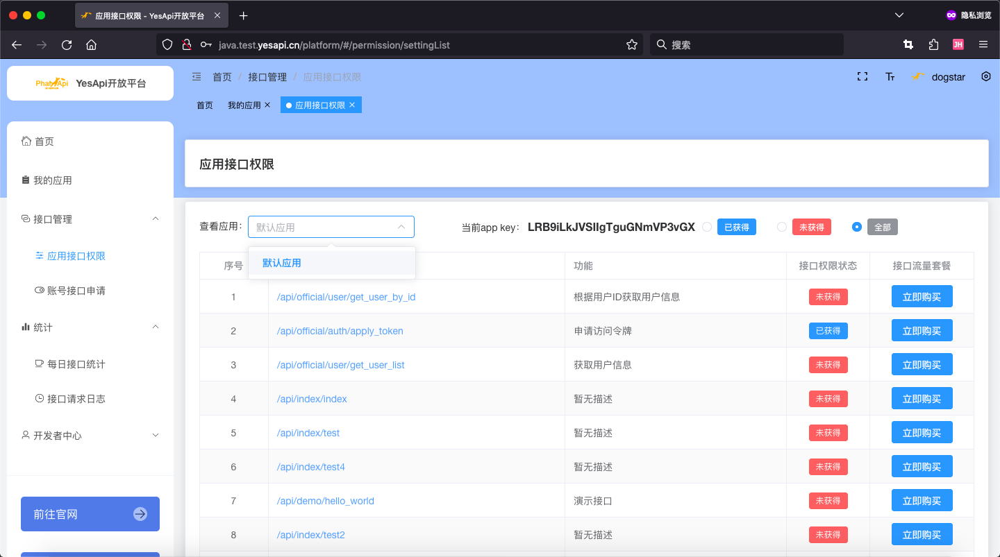

## 账号接口申请

对于未获得权限的接口，如需使用，可以进行接口权限申请。成功申请后，等待管理后台审批。

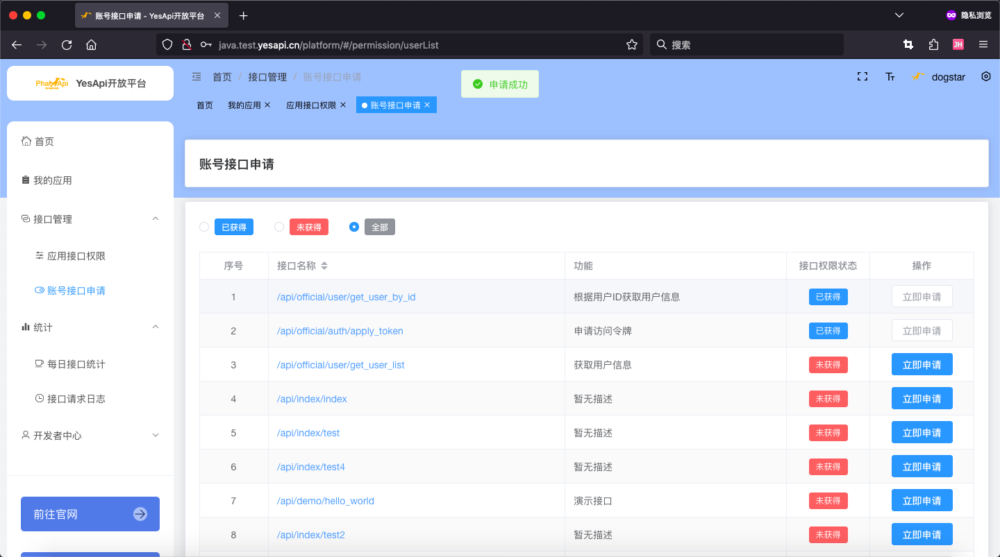

# 调用OpenAPI开放接口

开发者在调用开放接口前，需要先注册开发者账号，创建新的应用并等待管理员审核通过，并且只能调用已分配权限的接口。  

## 获取接口访问令牌

首先，开发者需要根据已申请的 ```app_key``` 和 ```app_secret``` 创建新的访问令牌。可以使用接口 **/official/auth/apply_token
申请访问令牌**。  

通过在线接口文档，找到并选择【/official/auth/apply_token】申请访问令牌。输入应用的app_key和密钥，获取令牌：  
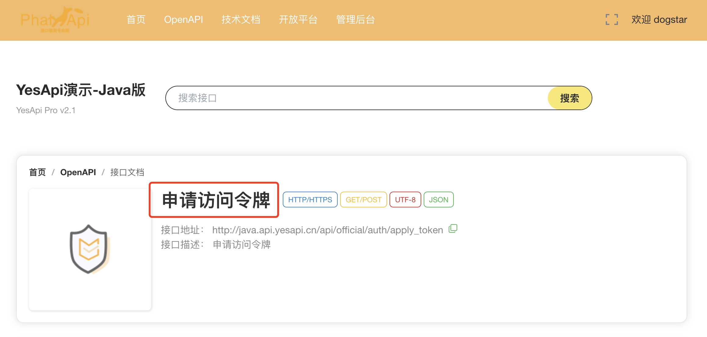   

例如：  
```bash
curl -X 'POST' \
  'http://java.api.yesapi.cn/api/official/auth/apply_token' \
  -H 'accept: */*' \
  -H 'Content-Type: application/json' \
  -d '{
  "app_key": "LRB9iLkJVSIIgTguGNmVP3vGX",
  "app_Secret": "EyC1ceQ87Md4cFPR8eJZ4Lod1CKJTxTuVHk4eChetpV5gLGQCgCfXODoj8yH",
  "uid": 0
}'
```

申请成功后，接口会返回access_token访问令牌，以及expire_at有效时间。例如：    
```json
{
  "code": 200,
  "message": "SUCCESS",
  "data": {
    "access_token": "OuOwEdzaZfKnhJij5vOvY9SAKvGFBTispj95ugIjXn6l1XF7VuBU3bQqsFAY1FYPDX+OxLUKM8kYu6o3HwZJWTFOhXu1WKK4P1/LFHT4/IaKLdnrOv7cFb6dgVqTiB0BW9K6uMCWthOiV98XZXhdhN6hcUGR55qLles5OUTECG0=",
    "expire_time": "2024-12-12 08:28:28",
    "expire_at": 1733992108935
  }
}
```

得到令牌access_token后，便可继续请求其他API接口。  


## 请求具体的开放接口

接下来，就可以根据access_token访问令牌，访问其他的开放接口。 

例如，调用 Hello World 接口，  
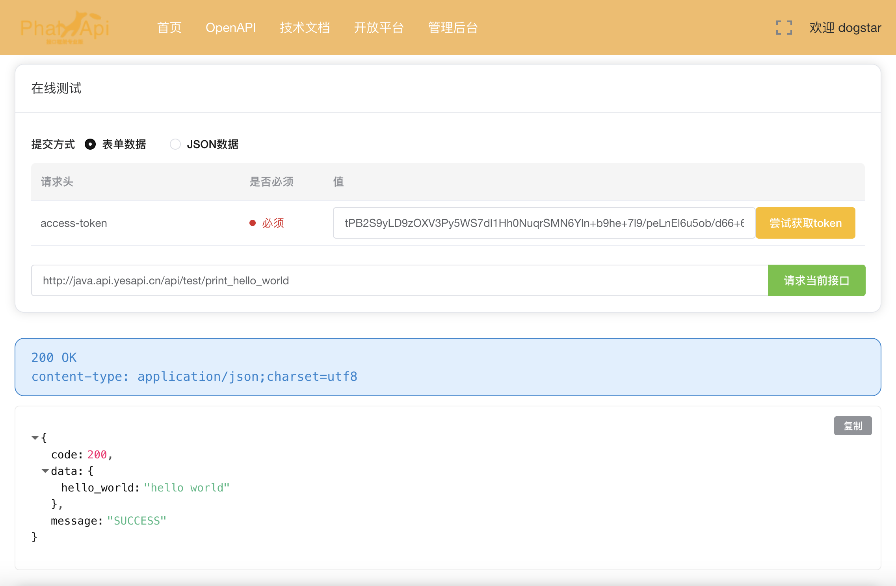  

curl请求报文是：  
```bash
curl -X 'GET' \
  'http://java.api.yesapi.cn/api/test/print_hello_world' \
  -H 'access-token: 你的访问令牌' \
  -H 'accept: */*'
```

得到的请求结果类似： 
```json 
{"code":200,"message":"SUCCESS","data":{"hello_world":"hello world"}}
```


# 统计

统计模块，主要提供了每日接口统计，支持日期范围、AppKey、API接口的搜索，图形展示，数据表格；以及详细的接口请求日记。  

## 每日接口统计
每日接口统计：  

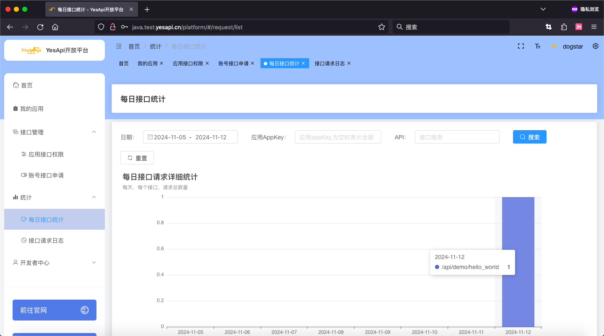  

## 接口请求日记
接口请求日志：   

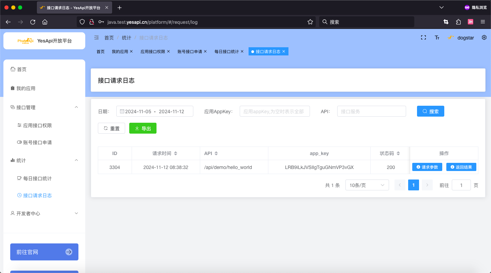  

# 开发者中心

## 开发者资料
查看和修改开发者资料。  
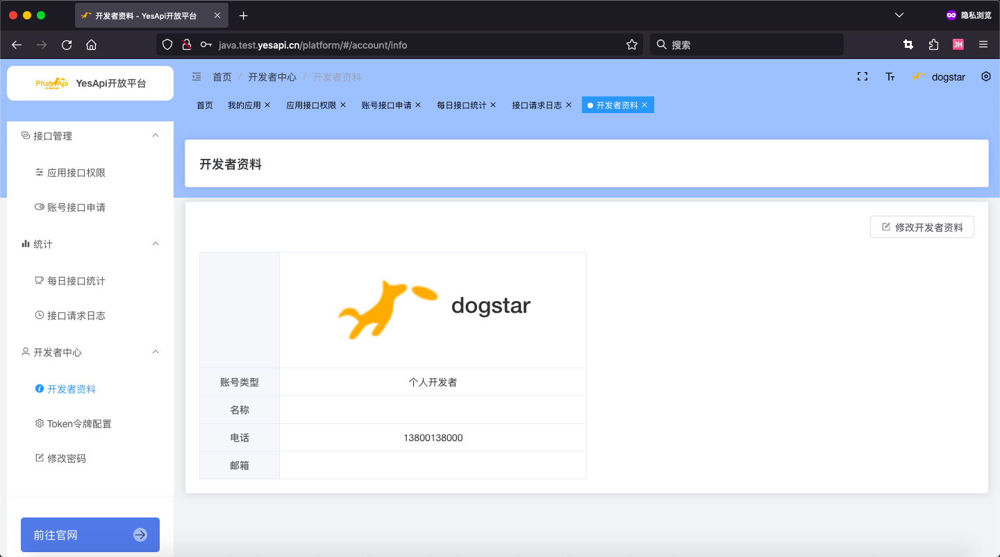   

## Token令牌管理
可以在线维护、查看和管理自己的接口令牌。  

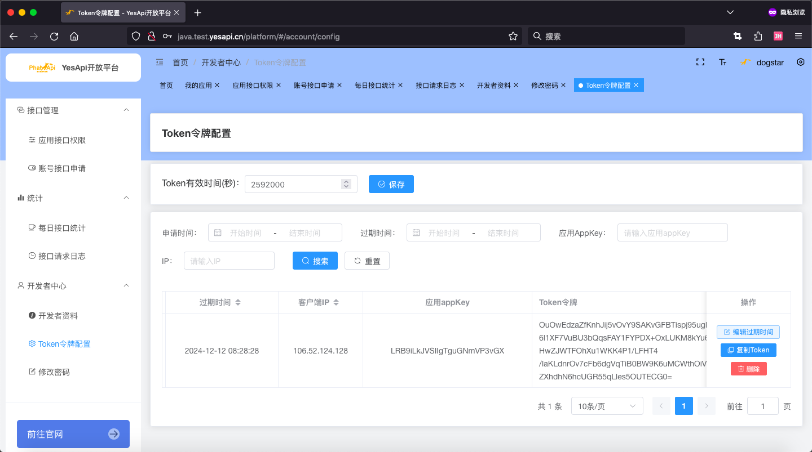

## 修改密码
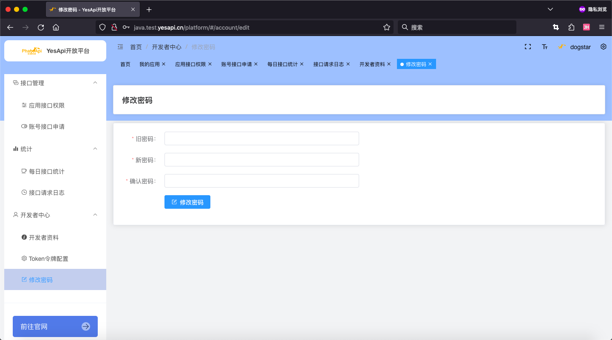  

# 移动版、黑夜模式和其他

你可以切换到黑夜模式，也可以使用手机移动端访问，还可以自己配置菜单布局方式。  

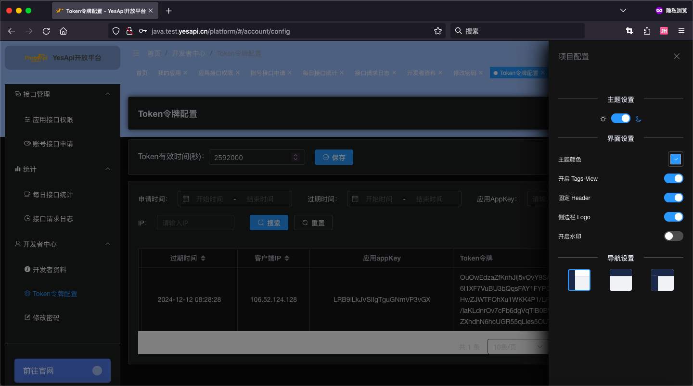   


手机移动端访问效果：
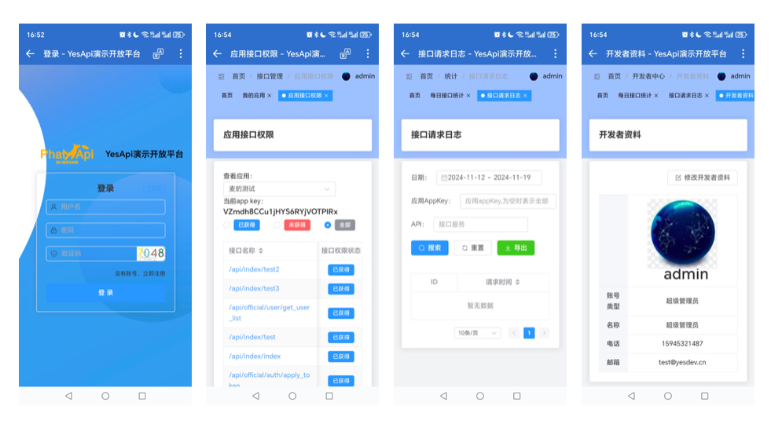   

